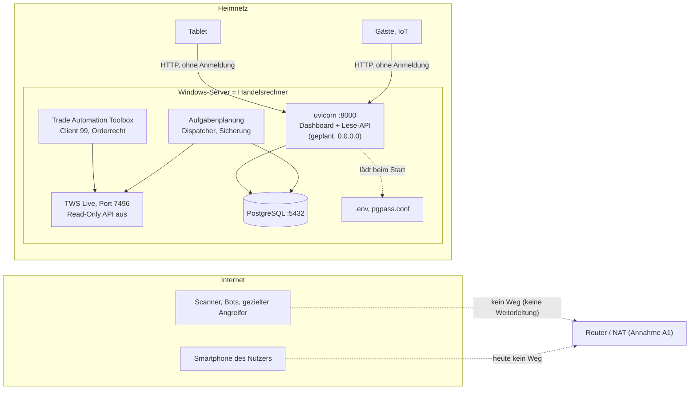
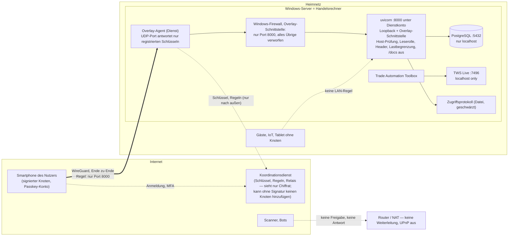

# F12 — Sicherer Fernzugang zum Dashboard: Spike-Bericht

- Status: **Spike abgeschlossen, Entscheidung offen.** Der daraus
  abgeleitete Vorschlag steht in
  [ADR 0059](../adr/0059-fernzugang-dashboard-overlay-netz.md) mit Status
  „Vorgeschlagen". Dieses Dokument ist die Grundlage dafür — Ist-Aufnahme,
  Threat Model, Variantenvergleich, Proof-of-Concept-Plan — und bleibt als
  Beleg erhalten, wie
  [earnings-anbieter-evaluation.md](earnings-anbieter-evaluation.md) und
  [g3-entscheidungsvorlage.md](g3-entscheidungsvorlage.md).
- Datum: 2026-09-06
- Gegenstand: Frage 13 aus Doc 10 §19 — „Wie erfolgt der sichere externe
  Zugriff auf das Dashboard?" —, in den Audits als F12 beziehungsweise E8
  geführt. [ADR 0049](../adr/0049-dashboard-mvp-nur-lan.md) hat sie für das
  MVP mit „kein externer Zugriff" beantwortet und die Neubewertung „nach
  stabilem Betrieb" angekündigt. Der Tageslauf läuft seit dem 2026-09-01
  automatisch (Doc 14, Betriebszustand). Dies ist die Neubewertung.
- Untersuchter Stand: Branch `dev`, Commit `cbbe978` (Merge von PR #75),
  Working Tree sauber. Untersucht wurden README, alle Dokumente unter
  `docs/`, alle 58 ADRs, beide Audits samt Nachverfolgung, die beiden
  vorangegangenen Spike-Berichte, die Konfiguration, die CI-Workflows, die
  Sicherungsskripte und der Anwendungscode von Frontend und Web-API. Eine
  unabhängige Review des Berichts (2026-09-06) ist eingearbeitet.
- **Ausdrücklich außerhalb des Umfangs:** jede Änderung an Anwendungscode,
  Firewall, Netzwerk, DNS, Zertifikaten, Konten, Cloud-Diensten oder dem
  laufenden Server. Es wurde nichts installiert, nichts registriert und
  keine Geheimnisdatei gelesen. Reihenfolge der Kriterien: Sicherheit vor
  Komfort, Kosten und Aufwand.

## Kennzeichnung in diesem Dokument

| Kennzeichen | Bedeutung |
|---|---|
| **Belegt** | im Repository verifiziert; die Fundstelle steht dabei |
| **Annahme** | plausibel, aber nicht belegt; vor dem PoC zu bestätigen |
| **Offen** | sicherheitsrelevante Information, die im Repository nicht steht; als Frage in Abschnitt 10 geführt |

Kürzel: Annahmen **A1–A7**, Dokumentationsbefunde **D1–D10**,
Anforderungen **S1–S18**, Rahmen **P1–P8**, Vorzugskriterien **VK1–VK5**,
Schutzgüter **SG1–SG7** (nicht zu verwechseln mit den Gates G1–G3 des
Projekts), Bedrohungen **T1–T20**, Varianten **V0–V4**, Restrisiken
**R1–R10**, offene Fragen **O1–O12**, Entscheidungspunkte **E1–E6**,
Abnahmekriterien **AK1–AK20**, Negativtests **N1–N16**, Notausschalter
**K1–K5**.

Produkte und Dienste werden **beispielhaft** genannt, wo eine Variante
ohne Beispiel abstrakt bliebe. Eine Anbieterwahl trifft dieses Dokument
nicht; sie gehört in den PoC, zusammen mit der Prüfung der
Nutzungsbedingungen — dieselbe Regel wie bei
[earnings-anbieter-evaluation.md](earnings-anbieter-evaluation.md).

---

## 1. Zusammenfassung

**Die Frage ist falsch gestellt, wenn sie „öffentlich" heißt.** Das
Dashboard hat genau einen Nutzer (Doc 01 §5). Finnhubs Einschränkung L8
([ADR 0017](../adr/0017-finnhub-fuer-earnings-und-ratings.md)) untersagt die
Weitergabe abgeleiteter Daten an Dritte, und das Deployment-Gate aus
[ADR 0022](../adr/0022-research-agent-quellen.md) sperrt jede Bereitstellung
außerhalb des privaten Prototyps. Ein öffentlich erreichbares Dashboard ist
damit nicht zu bewerten, sondern ausgeschlossen. Zu lösen ist ein
**privater Fernzugang für die registrierten Geräte des Nutzers**.

**Empfehlung:** ein identitätsgebundenes Overlay-Netz (WireGuard-basiertes
Mesh mit Koordinationsdienst, Anmeldung über einen Identitätsanbieter mit
phishing-resistenter MFA, ablaufende Geräteschlüssel, Zugriffsregel je
Gerät auf genau einen Port, Verbindungsaufbau vom Server nur nach außen).
Der Dienst bindet an Loopback und Overlay-Schnittstelle; am Router wird
nichts weitergeleitet, am Server antwortet kein Port auf unauthentifizierte
Pakete. Zwei Bedingungen sind K.-o.-Kriterien: Neue Knoten müssen von
einem bestehenden Knoten des Nutzers signiert werden — der
Koordinationsdienst allein darf keinen Peer hinzufügen können —, und die
Windows-Firewall bleibt als anbieterunabhängige zweite Ebene, die auf der
Overlay-Schnittstelle alles außer dem Dashboard-Port verwirft. Dazu die
Härtung des Dienstes selbst: eigenes Dienstkonto ohne Administratorrechte,
lesende Datenbankrolle, Host-Header-Prüfung, abgeschaltete
API-Dokumentation, Sicherheits-Header, Logging mit Schwärzung auch im
Webprozess, Zugriffsprotokoll in Datei, Lastbegrenzung, eigene Umgebung mit
nur einem Geheimnis. Der Notausschalter ist die Sperre des Server-Knotens
im Koordinationsdienst — von jedem Gerät aus, sofort.

**Zweite Wahl:** ein Identity-Aware Proxy mit ausgehendem Tunnel. Gleiche
Grundidee ohne eingehende Freigabe, aber mit öffentlichem Hostnamen und
öffentlicher Anmeldeseite, TLS-Endstelle beim Anbieter (er sieht den
Klartext — eine Frage an L8) und der Pflicht, das Identitätstoken im Dienst
selbst zu prüfen.

**Verworfen:** ein Reverse Proxy mit TLS und Anmeldung auf dem
Windows-Server hinter einer Portweiterleitung. Er macht den
Handelsrechner zum Webserver im Internet.

**Der wichtigste Befund liegt neben dem Dashboard.** Auf demselben Rechner
läuft die TWS mit Live-Konto, und dieselbe Instanz überträgt für die Trade
Automation Toolbox echte Optionsorders; „Read-Only API" ist deshalb bewusst
aus (Doc 14, Stufe D). Jeder Prozess auf diesem Rechner, der
`127.0.0.1:7496` erreicht, kann Orders übermitteln — auch ein
kompromittierter Dashboard-Prozess. Die Sicherheit des Fernzugangs ist
deshalb nicht die Sicherheit einer Anzeige, sondern die Sicherheit eines
Sprungbretts. Das bestimmt die Rangfolge der Varianten: Was das Internet
vom Rechner fernhält, gewinnt.

**Ein zweiter Befund ist vom Fernzugang unabhängig:** Der Webprozess
protokolliert heute ohne die Schwärzung aus ADR 0044 — die Log-Senke wird
nur vom CLI aufgesetzt (2.1).

**Nicht getan:** kein Code geändert, keine Infrastruktur berührt, kein
Dienst registriert. Was fehlt, steht als offene Frage in Abschnitt 10.

---

## 2. Ist-Architektur

### 2.1 Belegt

**Frontend**

| Befund | Fundstelle |
|---|---|
| Next.js 15, React 19, TypeScript strict, `recharts`; statischer Export (`output: 'export'`, `trailingSlash: true`, `poweredByHeader: false`) | `frontend/package.json`, `frontend/next.config.ts` |
| Reiner Browser-Client der API: relative Pfade unter `/api/v1`, `NEXT_PUBLIC_API_BASE` nur für `next dev`; kein SSR, keine Route Handler, keine Server Actions | `frontend/src/lib/api.ts`, [ADR 0052](../adr/0052-dashboard-als-statischer-export.md) |
| Keine externen Ressourcen: keine CDN-Skripte, keine Webfonts, keine Aufrufe fremder Hosts; kein `dangerouslySetInnerHTML` | `frontend/src/` (Suche nach `http`, `innerHTML`) |
| Vier Ansichten: Tagesübersicht, Berichtsdetail, Historie je Aktie, Backtesting; alle lesend | `frontend/src/app/`, Doc 10 §6.15 |
| Berichtsinhalte enthalten Modelltext (Technical Agent) — nicht vertrauenswürdiger Inhalt, den React beim Rendern maskiert | [ADR 0026](../adr/0026-technical-agent-ki-einordnung.md), Doc 11 |

**Web-API**

| Befund | Fundstelle |
|---|---|
| FastAPI, ausgeliefert von `uvicorn` **ohne** das Extra `standard` — reiner Python-HTTP-Stack (`h11`), kein `uvloop`, kein `httptools`, keine WebSockets | `backend/pyproject.toml` |
| Elf Endpunkte, ausnahmslos `GET`; kein Schreibpfad, kein Lauf über HTTP | `presentation/api/v1/*.py`, Doc 11, [ADR 0053](../adr/0053-lese-api-kein-lauf-ueber-http.md) |
| Statischer Export unter `/` eingehängt (`StaticFiles`, `html=True`), zuletzt registriert; fehlt der Ordner, läuft die API allein | `presentation/api/app.py` |
| **Keine** Middleware: keine Authentifizierung, keine CORS-Regel (nicht nötig, gleiche Herkunft), keine Sicherheits-Header, keine Ratenbegrenzung, keine Prüfung des `Host`-Headers, keine Proxy-Header-Auswertung | `presentation/api/app.py` (Suche nach `middleware`) |
| `/docs`, `/redoc` und `/openapi.json` sind eingeschaltet (FastAPI-Voreinstellung; die Anwendung schaltet nichts ab) | `presentation/api/app.py`, Doc 11, Abschnitt OpenAPI |
| Der Bootstrap der Web-Anwendung baut **keinen** Anbieter; einzige Ausnahme ist der Kerzenlieferant für den Chart, fest auf `stored` — der Webdienst erreicht die TWS nie | `bootstrap.py`, `build_app()`; `presentation/api/dependencies.py` |
| Der Webprozess lädt beim Start die **gesamte** `.env` in `Secrets` (alle Felder optional, benötigt wird nur `database_url`); alle gesetzten Werte werden zur Schwärzung angemeldet | `config/settings.py`, `Secrets`; [ADR 0044](../adr/0044-geheimnisse-an-der-log-senke-schwaerzen.md) |
| **Die Schwärzung wirkt im Webprozess nicht.** `configure_logging()` — JSON auf `stdout`, Schwärzung an der Senke — wird ausschließlich vom CLI aufgerufen; `main.py` und `build_app()` konfigurieren kein Logging. Der Webprozess läuft mit uvicorns Standardprotokoll (Klartext), und die Anmeldung der Geheimnisse in `Secrets` ist dort ohne den Formatter wirkungslos | `cli.py` (einzige Aufrufer von `configure_logging`), `main.py`, `bootstrap.py` (`build_app`), `observability/logging_setup.py` |
| `ATA_SESSION_SECRET` ist reserviert und ohne Wirkung | `config/settings.py`, [ADR 0049](../adr/0049-dashboard-mvp-nur-lan.md), [ADR 0053](../adr/0053-lese-api-kein-lauf-ueber-http.md) |
| Fehlerstruktur: FastAPI-Standard (`404`, `422`, `500`); Paginierung gedeckelt (`limit` ≤ 100); der Chart-Endpunkt liefert die **ganze** gespeicherte Reihe | Doc 11 |
| Logging des CLI: JSON auf `stdout`, Level `INFO`, Schwärzung an der Senke | `config/default.yaml` (`logging`), `observability/logging_setup.py`, ADR 0044 |

**Auslieferung und Betrieb (Sollzustand laut Doc 14, Stufe J — noch nicht eingerichtet)**

| Befund | Fundstelle |
|---|---|
| Start: `uvicorn ai_trading_analyst.main:app --host 0.0.0.0 --port 8000` als Autostart-Eintrag der Aufgabenplanung („Bei Systemstart"), erster Dauerprozess des Systems | Doc 14, Stufe J, Schritt 3 und 5; [ADR 0052](../adr/0052-dashboard-als-statischer-export.md) |
| Firewall: eingehend TCP 8000, **nur im privaten Profil**. „Keine Portweiterleitung am Router" ist die dokumentierte **Vorgabe** — der tatsächliche Routerzustand ist Annahme A1 und Frage O1 | Doc 14, Stufe J, Schritt 4; ADR 0049, Nachtrag |
| Abnahmekriterium: aus dem eigenen Netz erreichbar, aus dem Mobilfunknetz nicht | Doc 14, Stufe J |
| **„Der Dashboard-Dienst läuft noch nicht."** Gebaut und beschrieben, auf dem Server nicht eingerichtet | Doc 14, Betriebszustand |
| Der Autostart-Eintrag leitet `stdout` nicht um; das Zugriffsprotokoll von `uvicorn` ginge damit verloren | Doc 14, Stufe J, Schritt 5 (Tabelle ohne Umleitung) |
| Kein Container, kein Reverse Proxy — als Stufe, nicht als Endzustand: „Kommt die externe Erreichbarkeit, kommen Reverse Proxy und TLS zurück auf den Tisch" | ADR 0052, Konsequenzen; [ADR 0036](../adr/0036-nativer-windows-betrieb.md), Nachtrag |
| Doc 14 nennt für keine der drei Aufgaben (Tageslauf, Sicherung, Dashboard) das ausführende Windows-Konto; der Projektpfad lautet `C:\Users\Administrator\Documents\TradingViewAnalyzer` | Doc 14, Stufe F, Sicherung, Stufe J |

**Der Host**

| Befund | Fundstelle |
|---|---|
| Ein Windows-Server trägt alles: TWS, PostgreSQL, Python-Umgebung, Aufgabenplanung; Windows-Edition und Build sind nirgends dokumentiert | Doc 13, Doc 10 §14; `spikes/tradingview-cdp/REPORT.md` („Edition/Build noch zu erfassen") |
| TWS mit **Live-Konto**, Port 7496, angemeldete Desktop-Sitzung; „Allow connections from localhost only" war am 2026-08-11 aktiv | Doc 14, Stufe D; `spikes/ibkr-marketdata/REPORT.md`, Frage 1 |
| **„Read-Only API" ist bewusst nicht aktiv**, weil die Trade Automation Toolbox (Client-ID 99) über dieselbe TWS-Instanz echte Optionsorders überträgt | Doc 14, Stufe D; ADR 0013, ADR 0014, ADR 0018; IBKR-Spike, Frage 8 |
| Der Analyzer ruft ausschließlich lesende TWS-Methoden auf; die Lesebeschränkung steht im Code, nicht in der TWS | IBKR-Spike, Frage 8; `infrastructure/ibkr/` |
| Der Produktivadapter nutzt die `IB`-Klasse von `ib_async`, die beim Verbinden Konto- und Positionsdaten in den Prozessspeicher synchronisiert; der `ib_async`-Logger steht auf `WARNING`, damit nichts davon ins Protokoll gelangt. Gespeichert wird davon nichts | `infrastructure/ibkr/bar_source.py`; IBKR-Spike, „Sicherheitsfund" |
| Kein Windows-Autologon; nach dem sonntäglichen Neustart werden Anmeldung und TWS-Start von Hand erledigt — der Projektinhaber „schaltet sich auf den Server" | [ADR 0018](../adr/0018-kein-windows-autologon.md), Doc 14 „Nach jedem Serverneustart" |
| PostgreSQL lokal; Rolle `ata` ist Eigentümerin der Datenbank; Passwort in `%APPDATA%\postgresql\pgpass.conf` für die Sicherung | Doc 14, Stufe B und Sicherung |
| Sicherung: täglicher `pg_dump` per Aufgabenplanung, vierzehn Tage, Lesbarkeitsprüfung, Zählprobe; laut Doc 14 „auf demselben Laufwerk" — die Beispielpfade (`C:\Users\…` für das Projekt, `D:\backups\ata` für die Dumps) lassen offen, ob das ein zweites Laufwerk oder eine zweite Partition ist (D10); die `.env` wird nirgends mitgesichert | Doc 14, Sicherung; Doc 13, Persistente Daten; `scripts/sicherung.ps1` |
| Geheimnisse: `.env` im Projektwurzelverzeichnis (Klartext) mit Datenbank-URL, Anthropic-Schlüssel, Finnhub-Schlüssel, Telegram-Token, EDGAR-Kontaktadresse; `.gitignore` schließt `.env`, `*.pem`, `*.key`, `secrets/` aus; CI prüft, dass keine `.env` eingecheckt ist | `.env.example`, `.gitignore`, `.github/workflows/ci.yml`, [ADR 0005](../adr/0005-konfiguration-und-secrets.md) |
| Abhängigkeitsprüfung: `audit.yml` wöchentlich, **nicht blockierend**; Dependabot nur für npm und GitHub Actions; Bescheid im Quartalsturnus (nächster 2026-12-01); vier `postcss`-Advisories bewusst offen | `.github/workflows/audit.yml`, `.github/dependabot.yml`, Doc 14, Pflege |
| Das Repository ist **öffentlich**; Merge-Schutz aktiv | [ADR 0031](../adr/0031-merge-schutz-aktiv.md) |

**Daten, die das Dashboard zeigt**

| Datenart | Herkunft | Einstufung |
|---|---|---|
| Läufe, Kandidaten, Scores, Empfehlungsstufe, Bericht mit achtzehn Punkten | eigene Berechnung aus IBKR-Kerzen, Finnhub-Terminen und -Voten, EDGAR-Kennzahlen, Modelltext | abgeleitete Daten — Finnhub L8: keine Weitergabe an Dritte; Anthropic-Ausgaben: ADR 0022 Deployment-Gate |
| Optionsvorschläge (Strike, Prämie, Delta) und Optionsbacktests | IBKR-Optionskette, modellierte Rückrechnung | Handelsabsichten des Nutzers ablesbar |
| Kerzen und Indikatoren im Chart, über die volle gespeicherte Reihe | IBKR-Bestand | Marktdaten unter IBKR-Bedingungen ([ADR 0014](../adr/0014-ibkr-produktivintegration-freigegeben.md)) |
| Watchlist (rund 190 Symbole) | Export des Nutzers | persönliches Interesse, Rückschluss auf Positionen möglich |
| **Nicht** gespeichert und nicht angezeigt: Depot, Positionen, Kontostände, Orders, Zugangsdaten | `build_app()` baut keinen TWS-Anbieter; Doc 05 | — |
| Personenbezogene Daten: keine Nutzerkonten — die fünfzehn Tabellen der Persistenz kennen keine Nutzertabelle —, keine Namen; die EDGAR-Kontaktadresse liegt nur in der `.env` | `infrastructure/persistence/` (`__tablename__`), `config/settings.py`; Doc 10 §13 „Datenschutz" als Vorgabe | minimal |

**Bestehender Fernkanal:** die Telegram-Ergebnismeldung — ausgehend,
bewusst dünn (Symbole, Signaltypen, Scores, Stufe; keine Kurse, kein Link;
[ADR 0040](../adr/0040-inhalt-der-ergebnismeldung.md),
[ADR 0047](../adr/0047-scores-in-der-ergebnismeldung.md),
[ADR 0055](../adr/0055-put-vorschlag-und-signalzahl-in-der-ergebnismeldung.md)).
Der Nachtrag zu ADR 0040 bindet die Frage nach einem Link ausdrücklich an
die Neubewertung der Exposition — also an dieses Dokument.

**Was die Dokumentation fordert**

| Forderung | Fundstelle |
|---|---|
| „Das Dashboard ist nicht öffentlich zugänglich." Mindestens erforderlich: Login, sichere Passwortspeicherung, Sitzungsablauf, Schutz administrativer Funktionen — also ein Login **auch** für ein nicht öffentliches Dashboard | Doc 10 §13 „Authentifizierung" |
| Bevorzugt privates Netz oder VPN, alternativ abgesicherter Reverse Proxy mit TLS; **keine** ungeschützte Veröffentlichung von Backend- oder Datenbankports | Doc 10 §13 „Netzwerkzugriff" |
| Authentifizierung für alle privaten Endpunkte, separate Berechtigung für manuelle Läufe | Doc 10 §6.14 |
| Reverse Proxy und TLS „erst mit dem externen Webzugriff" | Doc 10 §3 |
| Neubewertung von Exposition und Auth nach stabilem Betrieb, als eigenes ADR, zusammen mit der Reverse-Proxy-/Container-Frage | ADR 0049, ADR 0052 |
| Vor jeder externen Erreichbarkeit: eigene Entscheidung (Deployment-Gate) und Prüfung von Finnhub L8 | ADR 0022, ADR 0017, ADR 0049 |
| Kompensierende Maßnahmen für den Betrieb wurden im Gate-G3-Prozess benannt — dediziertes rechteminimiertes Betriebskonto, BitLocker, Netzsegmentierung, Login-Monitoring — und **„NICHT WEITER VERFOLGT"** | [g3-entscheidungsvorlage.md](g3-entscheidungsvorlage.md), Strang B, Prüfschritt B3 |

### 2.2 Annahmen

| # | Annahme | Woraus sie folgt | Folge, wenn falsch |
|---|---|---|---|
| A1 | Der Server steht in einem **privaten Heimnetz hinter einem Router mit NAT**, Adresse per DHCP, WLAN im selben Netz | ADR 0049, Nachtrag: „vom Tablet im selben WLAN"; Doc 14, Stufe J: Adresse „per DHCP", „am Router kein Port weitergeleitet", Abnahmetest aus dem Mobilfunknetz | Steht der Server in einem Rechenzentrum mit öffentlicher Adresse, ist die Windows-Firewall heute die einzige Grenze — dann ist Abschnitt 5 dringender, nicht anders |
| A2 | Die Aufgaben der Aufgabenplanung laufen **unter dem Administrator-Konto** | Projektpfad unter `C:\Users\Administrator\...`; kein anderes Konto dokumentiert | Läuft schon ein eigenes Konto, entfällt ein Teil von Abschnitt 8.4 |
| A3 | Zugreifen sollen **eigene Geräte des Nutzers**: Smartphone, Tablet, Notebook | Doc 01 §5; ADR 0049, Nachtrag („Tablet") | Fremde Geräte (Rechner Dritter, Kiosk) würden die Empfehlung in Richtung Variante V2 verschieben |
| A4 | Es gibt **kein** eingerichtetes VPN ins Heimnetz | ADR 0049 formuliert es bedingt: „wahlweise über ein ohnehin vorhandenes VPN" | Ein Router-VPN wäre Variante V1a und als Zwischenlösung heute schon nutzbar — mit den Einschränkungen aus Abschnitt 6 |
| A5 | PostgreSQL lauscht nur auf `localhost` (Standard) | Sicherungsskript verbindet über `localhost`; nichts Gegenteiliges dokumentiert | Ein LAN-weit erreichbarer Datenbankport wäre ein eigener Befund (T8); im PoC wird das Abnahmekriterium AK16 |
| A6 | Das Servernetz ist als **privat** eingestuft | Doc 14 Stufe J setzt es voraus („dann ist die Netzwerkeinstufung zu korrigieren") | Im öffentlichen Profil griffe die geplante Regel nicht — und die Standardregeln wären strenger, nicht laxer |
| A7 | Der Server startet **wöchentlich** neu (Sonntagnacht) und bezieht Windows-Updates | ADR 0018 („sonntäglicher Neustart") | Ohne automatische Updates fehlt ein Patch-Prozess für das Betriebssystem, unabhängig von dieser Entscheidung |

### 2.3 Fehlende oder widersprüchliche Dokumentation

| # | Befund | Wo |
|---|---|---|
| D1 | Doc 10 §13 verlangt Login, Passwortspeicherung und Sitzungsablauf; ADR 0049 und Doc 11 stellen fest, dass es keine Authentifizierung gibt. Der Abschnitt trägt keinen Hinweis auf die Entscheidung — anders als §6.14, §6.15 und §14, die ihre MVP-Zuschnitte kennzeichnen | Doc 10 §13 |
| D2 | Doc 10 §14 sagt im selben Abschnitt „Ein automatischer Start der Anwendung ist damit ausgeschlossen" (Neustartverhalten) und „`uvicorn` als Autostart-Eintrag der Aufgabenplanung" (Bestandteile) | Doc 10 §14 |
| D3 | Doc 13 sagt „Ein Sicherungsverfahren ist noch nicht beschlossen"; ADR 0036 (Nachtrag 2026-09-01) und Doc 14 beschreiben das beschlossene und skriptierte Verfahren | Doc 13, Abschnitt Backup |
| D4 | README beschreibt unter „Backend lokal starten" weiterhin `POST /api/v1/analysis-runs`; der Endpunkt ist seit ADR 0053 entfernt | `README.md` |
| D5 | Doc 02 §2.12 verlangt einen „Link zum Dashboard" in der Benachrichtigung; ADR 0040 schließt den Link aus. Die Kopfnotiz von Doc 02 erklärt §2.12 pauschal für nicht vorhanden, obwohl es seit ADR 0040/0047 eine Ergebnismeldung gibt | Doc 02 |
| D6 | Kein Dokument nennt: Windows-Edition und Build, das ausführende Konto der Aufgaben, den Fernwartungsweg des Projektinhabers, die Netztopologie, den Router, die Datenträgerverschlüsselung. Für eine Betriebsdokumentation eines Handelsrechners sind das Lücken — teils bewusst, weil das Repository öffentlich ist. Dann gehört an ihre Stelle ein Hinweis, **wo** sie stehen | Doc 13, Doc 14 |
| D7 | Der Autostart-Eintrag in Doc 14 Stufe J leitet `stdout` nicht um; das Zugriffsprotokoll des Dashboards ginge verloren, ohne dass es jemand merkt — und der Webprozess konfiguriert ohnehin kein Logging (2.1) | Doc 14, Stufe J, Schritt 5 |
| D8 | Doc 11 sagt über `/docs` und `/openapi.json`: „nur im eigenen Netz erreichbar, wie die API selbst" — mit dem Fernzugang stimmt das nicht mehr, und beide bräuchten dann einen Beschluss | Doc 11, Abschnitt OpenAPI |
| D9 | Doc 10 §3 führt den externen Webzugriff weiterhin als „(F12, unentschieden)"; seit ADR 0049 ist F12 entschieden, und Doc 10 §19 sagt das auch | Doc 10 §3 |
| D10 | Doc 14 nennt die Ablage der Sicherung „auf demselben Laufwerk"; die Beispielpfade zeigen das Projekt auf `C:` und die Dumps auf `D:`. Ob das dieselbe Platte ist, sagt kein Dokument | Doc 14, Sicherung |

Keiner dieser Punkte wird hier korrigiert. Sie gehören zur Umsetzung von
ADR 0059; D1 bis D5, D9 und D10 unabhängig davon in die nächste
Dokumentationspflege.

---

## 3. Anforderungen und Rahmen

### 3.1 Sicherheitsanforderungen (aus der Aufgabenstellung, hier nummeriert)

| # | Anforderung | Wie sie in Abschnitt 7 und 8 wiederkehrt |
|---|---|---|
| S1 | Kein direkter öffentlicher Zugriff auf den Python-Dienst | Kriterium 1, 7 |
| S2 | Keine Portweiterleitung vom Internet auf das Frontend | Kriterium 2 |
| S3 | TLS für alle externen Verbindungen | Kriterium 5; Abschnitt 8.3 zur Frage „Tunnel oder TLS" |
| S4 | Phishing-resistente MFA, soweit technisch möglich | Kriterium 3; Abschnitt 8.1 (Passkey-Pflicht ohne schwächeren Rückfall) |
| S5 | Individuelle Benutzerkonten statt geteilter Zugangsdaten | Kriterium 3, 4 |
| S6 | Rollenbasierte oder explizite Zugriffskontrolle | Kriterium 4, 6; Abschnitt 8.1 (Regel beim Anbieter **und** Windows-Firewall) |
| S7 | Sichere Session- und Cookie-Konfiguration | Kriterium 3; Abschnitt 8.1 und 8.5 (der Dienst selbst hat keine Sitzung; die Sitzung der Anbieterkonsole ist das Schutzgut) |
| S8 | Ratenbegrenzung und Schutz gegen automatisierte Angriffe | Kriterium 1, 3; Abschnitt 8.2 (Lastbegrenzung auch gegen registrierte Geräte) |
| S9 | Minimale Windows-Firewall-Regeln | Kriterium 2, 6; Abschnitt 8.2 |
| S10 | Dienstkonto mit minimalen Berechtigungen | Abschnitt 8.4 |
| S11 | Sichere Ablage und Rotation von Geheimnissen | Kriterium 8; Abschnitt 8.4 |
| S12 | Regelmäßige Updates und Patch-Prozess | Kriterium 10; Abschnitt 8.6 |
| S13 | Revisionsfähige, datensparsame Zugriffsprotokollierung | Kriterium 9; Abschnitt 8.6 |
| S14 | Alarmierung bei auffälligen Anmelde- und Zugriffsmustern | Kriterium 9; Abschnitt 8.6 |
| S15 | Dokumentierter Notausschalter | Kriterium 12; Abschnitt 12 |
| S16 | Backup- und Recovery-Konzept | Abschnitt 8.7 |
| S17 | Klare Trennung zwischen lesender Anzeige und transaktionalen Funktionen | Abschnitt 4 und 8.5 |
| S18 | Falls Schreibfunktionen: zusätzliche Freigaben, Step-up, unveränderbares Audit-Log, getrennte Autorisierung | Abschnitt 8.5, Stufe 3 |

### 3.2 Rahmen aus dem Projekt

| # | Rahmen | Quelle |
|---|---|---|
| P1 | Genau ein Nutzer. Kein Mehrnutzerbetrieb, keine Weitergabe | Doc 01 §5; ADR 0017 L8; ADR 0022 Deployment-Gate |
| P2 | Die API bleibt lesend. Kein Lauf, keine Konfiguration über HTTP | ADR 0053 |
| P3 | Der Server ist der Handelsrechner: TWS mit Live-Konto, TAT mit Orderrecht, Read-Only API aus | Doc 14 Stufe D; ADR 0014; ADR 0018 |
| P4 | Kein Autologon, angemeldete Sitzung nötig; wöchentlicher Neustart mit Handgriff | ADR 0018 |
| P5 | Nativer Windows-Betrieb; Container und Reverse Proxy sind als Stufe verneint, nicht endgültig | ADR 0036, ADR 0052 |
| P6 | Das Repository ist öffentlich: nichts, was den Server identifiziert, gehört in ein Dokument | ADR 0031; `.env.example` (Begründung zur EDGAR-Adresse) |
| P7 | Geheimnisse nur über `ATA_`-Umgebungsvariablen; Schwärzung an der Senke | ADR 0005, ADR 0044 |
| P8 | Jede Architekturentscheidung als ADR; Doc 10 ist bei Widersprüchen maßgeblich | ADR 0001 |

### 3.3 Vorzugskriterien (aus der Aufgabenstellung)

Die Aufgabenstellung bevorzugt Lösungen, bei denen gilt:

| # | Vorzugskriterium |
|---|---|
| VK1 | Keine eingehenden Ports am Windows-Server werden geöffnet |
| VK2 | Der Anwendungsdienst bleibt ausschließlich an `localhost` oder eine interne Schnittstelle gebunden |
| VK3 | Vorgelagerte, starke Identitätsprüfung mit MFA |
| VK4 | Zugriffe nach dem Least-Privilege-Prinzip eingeschränkt |
| VK5 | Der Windows-Server wird nicht als allgemein erreichbarer Webserver betrieben |

Abschnitt 7 prüft jede Variante daran.

---

## 4. Muss das Dashboard öffentlich erreichbar sein?

**Nein — und es darf es nicht.**

- **Ein Nutzer.** Doc 01 §5: „Der Nutzer selbst." Es gibt keinen zweiten,
  für den ein öffentlicher Zugang gebaut würde.
- **Lizenz.** Finnhub L8 untersagt die Weitergabe abgeleiteter Ergebnisse an
  Dritte; das Dashboard zeigt genau solche Ergebnisse (Analystenvoten als
  Score-Komponente, Berichtstermine als Filterstatus). Das Deployment-Gate
  aus ADR 0022 sperrt „öffentlicher Zugriff, Mehrnutzerbetrieb, kommerzielle
  Nutzung oder Weitergabe von Berichten an Dritte" bis zu einer rechtlichen
  Prüfung, die niemand beauftragt hat.
- **Der Fernzugang für unterwegs existiert bereits** — die
  Telegram-Meldung —, und er ist absichtlich dünn (ADR 0040). Was fehlt, ist
  der Blick in den vollständigen Bericht von unterwegs, nicht ein
  Webangebot.
- **Der Preis eines öffentlichen Endpunkts fällt auf den Handelsrechner.**
  Ein öffentlich erreichbarer Port zieht Scanner, Brute-Force-Versuche und
  Volumen an; das trifft denselben Uplink, über den die TWS Kurse holt
  (Rahmen P3).

Daraus folgt die Umformulierung der Aufgabe: **Der Nutzer soll von seinen
eigenen, registrierten Geräten aus von überall lesend auf das Dashboard
zugreifen können — und niemand sonst soll den Dienst überhaupt sehen.** Ein
Erfolgskriterium, das später prüfbar ist: Von einem nicht registrierten
Gerät aus kommt keine Verbindung zustande — kein Anmeldedialog, kein
Zertifikat, keine Antwort, die einen Dienst verrät.

Was dabei **nicht** verlangt wird und deshalb auch nicht gebaut werden
sollte: ein öffentlicher Zugangsname, ein Anmeldeformular im Internet,
Mehrnutzerfähigkeit, Schreibfunktionen.

---

## 5. Threat Model

### 5.1 Schutzgüter

| Schutzgut | Was daran hängt | Einstufung |
|---|---|---|
| **SG1 TWS-Sitzung und Brokerkonto** | Orderübermittlung über `127.0.0.1:7496` (Read-Only API aus); TAT-Konfiguration; angemeldete Desktop-Sitzung | **kritisch** — Geld |
| **SG2 Der Windows-Host** | Alles darauf: Aufgabenplanung, Datenbank, Geheimnisse, Sicherungen; Ausgangspunkt für SG1 | **kritisch** |
| **SG3 Geheimnisse** in `.env` und `pgpass.conf` | Anthropic-Schlüssel (Kosten), Finnhub-Schlüssel (Kontosperre), Telegram-Token (**gefälschte Empfehlungen aufs Telefon**), Datenbank-URL | hoch |
| **SG4 Integrität der Analyseergebnisse** | Läufe, Berichte, Scores in PostgreSQL; die Sicherungen | hoch — eine manipulierte Empfehlung wird gehandelt |
| **SG5 Vertraulichkeit der Analyseergebnisse und der Watchlist** | Handelsabsichten, Positionen ableitbar; Lizenzpflichten (L8, ADR 0022) | mittel bis hoch |
| **SG6 Verfügbarkeit des Tageslaufs** | Uplink, TWS-Verbindung, Prozessor, Datenbank; der Dispatcher teilt sie mit dem Dashboard-Dienst | mittel — ein ausgefallener Tag wird gemeldet, nicht nachgerechnet |
| **SG7 Identität des Nutzers, seine Geräte und die Sitzung der Anbieterkonsole** | Konto beim Identitätsanbieter, Geräteschlüssel, Telefon; die Konsolensitzung steuert Regeln, Gerätefreigaben und den Notausschalter | hoch — Schlüssel zu allem oben |

### 5.2 Angreifer

| Akteur | Fähigkeit | Motiv |
|---|---|---|
| Massenscanner und Bots | erreichen jeden offenen Port im Internet binnen Minuten; Credential Stuffing gegen jedes Anmeldeformular | opportunistisch |
| Gezielter Angreifer mit Vorwissen | kennt das öffentliche Repository — Pfade, Ports, Endpunkte, Betriebsanleitung — und weiß, dass ein Brokerkonto dahinter liegt | Geld |
| Bösartige Webseite oder App auf einem **eigenen**, registrierten Gerät | kann im Browser des Nutzers Anfragen an Adressen richten, die der Browser erreicht — auch Overlay-Adressen, solange das Overlay verbunden ist | Mitnahme |
| Kompromittiertes oder entwendetes Endgerät des Nutzers | sieht, was der Nutzer sieht; hält Sitzungen, Schlüssel, Cookies — auch die Sitzung der Anbieterkonsole | Mitnahme |
| Dritter im Heimnetz | Gäste, IoT-Geräte, ein infizierter Rechner im WLAN | opportunistisch |
| Drittanbieter | Koordinationsdienst, Identitätsanbieter, Tunnelanbieter: Ausfall, Vorfall, geänderte Bedingungen — und im schlimmsten Fall ein Dienst, der selbst zum Angreifer wird | keines — aber Wirkung |
| Lieferkette | Agent-Software, npm- und PyPI-Pakete, GitHub-Actions | opportunistisch bis gezielt |

### 5.3 Vertrauensgrenzen

Heute liegt die einzige Grenze zum Internet am Router (Annahme A1) und
die einzige Grenze innerhalb des Hosts an den Windows-Berechtigungen —
die, laut Annahme A2, für alle Aufgaben dieselben sind.

### 5.4 Bedrohungen

Bewertung qualitativ: **Wahrscheinlichkeit × Auswirkung** je Szenario;
„heute" meint den Stand nach Doc 14 Stufe J (LAN, ohne Anmeldung), „bei
naiver Öffnung" eine Portweiterleitung auf den Dienst, wie er ist. Die
Gegenmaßnahmen verweisen auf Abschnitt 8.

| # | Bedrohung | Schutzgut | Weg | Heute | Bei naiver Öffnung | Gegenmaßnahme |
|---|---|---|---|---|---|---|
| T1 | Unbefugter Lesezugriff auf das Dashboard | SG5 | Jeder Client, der Port 8000 erreicht; keine Anmeldung | mittel — jedes Gerät im WLAN | **hoch** — jeder im Internet | Netzgrenze mit Identität und Gerätebindung (8.1); Dienst nur an interne Schnittstellen gebunden (8.2) |
| T2 | Zugriff auf Depot- oder personenbezogene Daten | SG3, SG5 | Über die API: keine (nicht gespeichert). Über den Host: `.env`, TWS-Sitzung | niedrig | mittel — als Folge von T7/T9 | Datensparsamkeit bleibt; Dienstkonto ohne Zugriff auf `.env`-Fremdschlüssel (8.4) |
| T3 | Manipulation angezeigter Empfehlungen | SG4 | Schreibzugriff auf PostgreSQL; Mitschnitt und Veränderung im Netz; XSS; manipulierter Build; gefälschte Telegram-Meldung mit gestohlenem Token | niedrig | mittel | Leserolle für den Dienst (8.4); verschlüsselter Tunnel (8.1); CSP und Header (8.2); `npm ci` aus Lock-Datei; Token-Schutz (8.4) |
| T4 | Manipulation oder Auslösung von Trades | SG1 | Kein Pfad über die Anwendung (lesend, ADR 0053). Pfad über den Host: Code-Ausführung im Dashboard-Prozess → `127.0.0.1:7496` → Order; oder Zugriff auf die Desktop-Sitzung | niedrig, **Auswirkung kritisch** | **mittel, Auswirkung kritisch** | Internet vom Host fernhalten (8.1); Dienstkonto, Leserolle, Lastbegrenzung (8.2, 8.4); Loopback-Grenze im PoC bestätigen (11.4); eigener Host als Ausbaustufe (8.5) |
| T5 | Diebstahl von Sitzungen oder Zugangsdaten | SG7 | Cookies, Tokens, Geräteschlüssel auf einem kompromittierten Gerät; Phishing gegen ein Anmeldeformular; ein Passwort-Rückfall beim Identitätsanbieter | entfällt (keine Anmeldung) | hoch, wenn Passwortlogin | Passkey-Pflicht ohne schwächeren Rückfall (8.1); kein Passwortformular im Dienst; ablaufende Geräteschlüssel; Sperre je Gerät; Abmeldung der Anbieterkonsole (8.1, 13) |
| T6 | Brute Force, Credential Stuffing | SG7 | Jedes Anmeldeformular im Internet | entfällt | hoch | Kein Anmeldeformular am Dienst; Anmeldung nur beim Identitätsanbieter, dort nur mit Passkey; unauthentifizierte Pakete erreichen den Dienst nicht (8.1) |
| T7 | Schwachstellen in Frontend oder Backend | SG2 | `uvicorn`/`h11`/`starlette`/`fastapi`; Next.js-Bündel; Recharts; Pfadbehandlung von `StaticFiles` | niedrig — nur Heimnetz | **hoch** — jeder kann Anfragen senden | Nur registrierte Geräte senden Anfragen (8.1); Patch-Turnus für den Web-Stack (8.6); Dienstkonto (8.4) |
| T8 | Direkte Erreichbarkeit interner Dienste | SG1, SG2 | 7496 (TWS: „localhost only" aktiv, Stand 2026-08-11), 5432 (Annahme A5), 8000 (`0.0.0.0` + Firewall), `/docs`, Remotezugang des Inhabers (**Offen** O2) | niedrig bis unbekannt | hoch | Bindung an Loopback und Overlay (8.2); Firewall je Schnittstelle (8.1, 8.2); TWS und PostgreSQL nur Loopback als Abnahmekriterium (AK16); Prüfung von außen (11.5); O2 klären |
| T9 | Lateralbewegung auf dem Windows-Server | SG1, SG2, SG3 | Aus dem Dashboard-Prozess heraus (Annahme A2: Administrator) zu TWS, Aufgabenplanung, `.env`, Sicherungen | niedrig, Auswirkung kritisch | mittel, Auswirkung kritisch | Dienstkonto ohne Adminrechte, NTFS-Rechte, eigene Umgebung (8.4); Agent-Software mit Auto-Update (8.6); Loopback-Grenze bestätigen (11.4) — die Windows-Firewall filtert Loopback nicht, das Dienstkonto trennt Dateien und Rechte, nicht die TWS |
| T10 | Datenabfluss | SG5 | Massenabruf über die paginierte API (`limit` ≤ 100, `total` sichtbar); Chart-Endpunkt liefert die ganze Reihe; Watchlist ableitbar | niedrig | mittel | Gerätebindung (8.1); Zugriffsprotokoll und Alarm bei unbekannter Quelle (8.6); Lizenzfrage nur intern (P1) |
| T11 | Denial of Service | SG6 | Volumen auf den Uplink des Handelsrechners; Prozessor und Datenbank durch teure Endpunkte (Chart mit voller Reihe, Backtest je Aktie) — **auch von einem registrierten Gerät** oder einem fehlerhaften Client, während der Tageslauf rechnet | niedrig | **hoch** — und trifft die TWS-Verbindung | Kein antwortender Port (8.1); Lastbegrenzung im Dienst: Gleichzeitigkeit, Timeouts, Prozesspriorität (8.2); Dienst getrennt vom Dispatcher — bleibt so |
| T12 | Fehlkonfiguration von TLS, Proxy, Firewall, Tunnel, Regel | SG2, SG5 | Falsches Firewall-Profil, `0.0.0.0` ohne Regel, Tunnel ohne Token-Prüfung am Ursprung, abgelaufenes Zertifikat, zu weite Zugriffsregel, Server als Quelle erlaubt | mittel | hoch | Wenige Stellschrauben (Variante ohne eigene TLS-Endstelle); Firewall als zweite Ebene, die eine zu weite Regel auffängt (8.1); Abnahmekriterien mit Negativtests (11.3); regelmäßige Prüfung von außen (13) |
| T13 | Kompromittiertes oder entwendetes Endgerät | SG7, SG5, SG6 | Registriertes Gerät in fremder Hand: liest, was der Nutzer liest, kann den Dienst mit Anfragen belasten (T11) und hält die Sitzung der Anbieterkonsole | entfällt | mittel | Schaden auf Lesen und Last begrenzt (P2, 8.2); Sperre je Gerät binnen gemessener Zeit (8.1, 12); Gerätesperre und Verschlüsselung auf den Geräten (Nutzerpflicht); Konsolensitzung kurz halten (8.1); Entscheidungspunkt Anmeldung im Dienst (10, E3) |
| T14 | Protokollierung sensibler Daten | SG3, SG5 | Der Webprozess protokolliert heute **ohne Schwärzung** (2.1): eine Datenbank-URL in einem Fehlertext stünde im Klartext; Tokens in URLs; Anbieterprotokolle mit Klartext (V2) | **mittel** | mittel | Logging mit Schwärzung auch im Webprozess (8.2, 8.6); keine Anfrageinhalte im Protokoll — es gibt nur `GET`; Anbieter, der Inhalte nicht sieht (8.1); Protokoll in Datei mit Rotation und Zugriffsrechten (8.6) |
| T15 | Drittanbieter und Cloud: Ausfall, Kontosperre, Bedingungen, Einblick | SG7, SG5, SG6 | Ausfall oder Kontosperre beim Koordinations-, Tunnel- oder Identitätsanbieter; geänderte Bedingungen; ein Anbieter, der Inhalte sieht (V2) | entfällt | je Variante | Ende-zu-Ende-Verschlüsselung (Anbieter sieht keine Inhalte); Wiederherstellungscodes offline; Ausfall kostet nur den Fernzugang; Nutzungsbedingungen vor der Wahl prüfen (8.1, 9) |
| T16 | Lieferkette der Agent-Software | SG2 | Ein Agent mit Systemrechten, vom Anbieter aktualisiert | entfällt | je Variante | Signierte Installationspakete, Auto-Update, Anbieter mit veröffentlichtem Sicherheitsprozess; keine Alternative ohne vergleichbare Komponente (jeder VPN-Client ist eine) |
| T17 | Geheimnisse im Klartext auf dem Host | SG3 | `.env` im Projektordner, lesbar für jeden Prozess unter demselben Konto; `pgpass.conf`; keine Sicherung der `.env` | mittel | mittel | Eigene Umgebung für den Dashboard-Prozess (8.4); NTFS-Rechte; Wiederherstellung dokumentieren (8.7) |
| T18 | Offenlegung über das öffentliche Repository und öffentliche Verzeichnisse | SG2 | Betriebsanleitung, Pfade, Ports sind bekannt; Hostnamen, Adressen, Kontonamen dürfen nie hinzukommen; Zertifikate für Overlay-Namen landen in öffentlichen Transparenzprotokollen (8.3) | mittel | hoch | Regel P6 in jedem Dokument; nichtssagende Knoten- und Netznamen (8.3); PoC-Ergebnisse ohne identifizierende Angaben festhalten |
| T19 | **DNS-Rebinding** aus dem Browser eines registrierten Geräts | SG5 | Eine bösartige Webseite lässt einen eigenen Hostnamen nach kurzer Zeit auf die Overlay-Adresse (heute: die LAN-Adresse) des Servers auflösen und liest die API per Skript — der Dienst prüft den `Host`-Header nicht, verlangt keine Anmeldung und antwortet mit JSON. Das Gerät ist dabei **nicht** kompromittiert, nur das Overlay verbunden | mittel — im LAN funktioniert derselbe Angriff | mittel | Prüfung des `Host`-Headers gegen Overlay-Name, Overlay-Adresse und Loopback (8.2); HTTPS im Tunnel — ein umgebogener Name scheitert am Zertifikat (8.3); Negativtest N14 |
| T20 | **Kompromittierte Kontrollebene** des Koordinationsdienstes | SG1, SG2, SG5 | Der Dienst verteilt Schlüssel **und** Regeln und setzt die Gerätefreigabe durch. Ohne Knotensignierung könnte ein kompromittierter oder bösartiger Dienst einen fremden Knoten einschleusen und die Regel für den Server weiten — dann erreicht der Angreifer jeden Dienst, der auf der Overlay-Schnittstelle lauscht (8000; RDP, falls O2 so ausgeht; 5432, falls A5 falsch ist). Ende-zu-Ende-Verschlüsselung hilft nicht, wenn der Angreifer der Endpunkt ist | entfällt | je Variante, **Auswirkung kritisch** | Signierung neuer Knoten durch einen bestehenden Knoten als K.-o.-Kriterium (8.1); Windows-Firewall auf der Overlay-Schnittstelle: nur der Dashboard-Port (8.1, N16); TWS und PostgreSQL nur Loopback (AK16); Alarm bei neuem Knoten; alternativ selbst gehostete Koordination (E4) |

---

## 6. Untersuchte Varianten

Jede Variante ist nach demselben Raster beschrieben: Ablauf, wo
Identität geprüft wird, was eingehend geöffnet sein muss, was auf dem
Windows-Server läuft, was sie nicht leistet.

### V0 — Status quo: nur eigenes Netz, Telegram als Fernkanal

Der Referenzpunkt. Kein Fernzugang, keine neue Angriffsfläche. Was fehlt:
der vollständige Bericht von unterwegs. Bleibt das Ziel unerreichbar, ist
V0 die richtige Antwort — sie ist nicht unsicher, nur unbequem.

### V1a — VPN am Router

Der Router terminiert ein VPN (beispielhaft: WireGuard oder IPsec in einer
FRITZ!Box oder einem vergleichbaren Heimrouter). Das Gerät des Nutzers
wählt sich ein und steht danach **im Heimnetz**, als wäre es im WLAN.

- Eingehend: ein UDP-Port am Router. Am Windows-Server nichts.
- Identität: Schlüsselpaar je Gerät oder geteiltes Geheimnis; **keine MFA,
  kein Identitätsanbieter**, keine Zugriffsregel je Gerät — das Gerät sieht
  das ganze Netz, auch Port 8000 und alles andere.
- Auf dem Server: nichts Neues. Der Dienst bleibt wie in Doc 14 Stufe J.
- Notausschalter: Gerät im Router löschen — von unterwegs nur, wenn der
  Router fernverwaltbar ist, was seinerseits eine Angriffsfläche ist.
- Verfehlt S4, S5 (teilweise), S6, S13, S14; erfüllt VK1, VK2 und VK5,
  nicht VK3 und VK4.
- Voraussetzung unbelegt: **Offen** O1 (Router, VPN-Fähigkeit).

### V1b — VPN-Server auf dem Windows-Server

WireGuard oder OpenVPN als Dienst auf dem Handelsrechner, Portweiterleitung
vom Router auf diesen Port.

- Eingehend: ein Port **am Handelsrechner**. Genau das, was vermieden
  werden soll (VK1, Rahmen P3).
- Identität wie V1a; zusätzlich ein selbst zu patchender Netzwerkdienst mit
  Systemrechten auf dem Handelsrechner.
- Kein Vorteil gegenüber V1a, alle Nachteile von V1a plus der Port. **Nicht
  weiter verfolgt.**

### V1c — Identitätsgebundenes Overlay-Netz

Ein WireGuard-basiertes Mesh mit Koordinationsdienst (beispielhaft:
Tailscale, NetBird, ZeroTier; selbst gehostete Koordination: Headscale,
NetBird selbst gehostet). Jeder Knoten — Server, Smartphone, Notebook —
meldet sich über einen **Identitätsanbieter** an (beispielhaft ein
bestehendes Google-, Microsoft-, Apple- oder GitHub-Konto mit Passkey oder
Hardware-Schlüssel), erhält einen eigenen, ablaufenden Geräteschlüssel und
eine Overlay-Adresse. **Zugriffsregeln** legen fest, welcher Knoten
welchen Port welches anderen Knotens erreicht. Der Server baut Verbindungen
nur nach außen auf; NAT-Durchdringung und, wo sie scheitert, Relais-Server
des Anbieters übernehmen den Weg — verschlüsselt Ende zu Ende, das Relais
sieht nur Chiffrat.

- Eingehend: keine Freigabe am Router, keine am Server. Genauer: Der Agent
  lauscht auf einem UDP-Port an allen Schnittstellen — sein Installer legt
  dafür eine Firewallregel an — und antwortet **nur** auf gültige
  Handshakes registrierter Schlüssel; unauthentifizierte Pakete bleiben
  unbeantwortet. Er versucht außerdem standardmäßig eine Portzuordnung am
  Router per UPnP oder NAT-PMP; die wird abgeschaltet (8.1).
- Identität: Identitätsanbieter mit MFA **plus** Geräteschlüssel
  (Besitzfaktor je Gerät). Zugriffsregel: nur benannte Geräte des Nutzers,
  nur Port des Dashboards. Ein nicht registriertes Gerät erhält keine
  Antwort. Das Konto beim Identitätsanbieter muss auf Passkeys allein
  stehen — Konsumentenkonten lassen Passwort, SMS und TOTP sonst als
  Rückfall zu (8.1).
- **Vertrauensanker ist der Koordinationsdienst.** Er verteilt Schlüssel
  **und** Regeln. Ohne Knotensignierung könnte ein kompromittierter Dienst
  einen fremden Knoten einschleusen und die Regel weiten (T20). Mehrere
  Anbieter bieten die Signierung neuer Knoten durch bestehende Knoten des
  Nutzers an; sie ist hier Bedingung, nicht Empfehlung — und die
  Windows-Firewall bleibt als zweite, anbieterunabhängige Ebene (8.1).
- Auf dem Server: der Agent als Windows-Dienst (Systemrechte, vom Anbieter
  aktualisiert); der Dashboard-Dienst bindet an Loopback und
  Overlay-Schnittstelle; Firewallregel für den Dashboard-Port nur auf der
  Overlay-Schnittstelle, alles Übrige dort verworfen.
- TLS: Der Tunnel ist authentifiziert und verschlüsselt (Noise-Protokoll);
  innerhalb des Tunnels läuft HTTP. Mehrere Anbieter stellen zusätzlich
  Zertifikate für den Overlay-Namen des Knotens aus, dann läuft HTTPS im
  Tunnel — zum Preis eines öffentlich nachlesbaren Namens (8.3).
- Notausschalter: Server-Knoten im Koordinationsdienst sperren oder
  löschen — von jedem Gerät aus; neue Verbindungen sofort, bestehende
  binnen einer Frist, die der PoC misst; lokal Dienst und Regel entfernen.
- Protokolle: Anmeldungen, Knotenanlagen, Regeländerungen beim
  Koordinationsdienst; Zugriffe je Overlay-Adresse (= Gerät) im lokalen
  Zugriffsprotokoll.
- Abhängigkeit: Koordinationsdienst (Schlüsselverteilung, Regeln) und
  Identitätsanbieter. Ausfall: kein Fernzugang; der Tageslauf läuft weiter.
- Nutzungsbedingungen und Kosten: Persönliche Stufen sind bei mehreren
  Anbietern kostenlos und auf eine Handvoll Geräte begrenzt — **Annahme**,
  im PoC am gewählten Anbieter zu prüfen.
- Was sie nicht leistet: Zugriff aus einem fremden Browser ohne
  Client-Software; Schutz gegen ein registriertes Gerät in fremder Hand
  (T13) über die Gerätesperre hinaus; Schutz gegen DNS-Rebinding aus dem
  eigenen Browser ohne Host-Prüfung im Dienst (T19).

### V2 — Identity-Aware Proxy mit ausgehendem Tunnel (ZTNA)

Ein Connector auf dem Server baut einen ausgehenden Tunnel zum Anbieter
auf; der Anbieter veröffentlicht das Dashboard unter einem **öffentlichen
Hostnamen** und stellt eine Anmeldung mit MFA davor (beispielhaft:
Cloudflare Tunnel mit Access, Twingate, vergleichbare Zero-Trust-Dienste).
Erst nach erfolgreicher Anmeldung leitet der Anbieter die Anfrage durch
den Tunnel an `127.0.0.1:8000`.

- Eingehend: nichts am Router, nichts am Server.
- Identität: Identitätsanbieter mit MFA, Regeln je Nutzer, teils je Gerät
  (Gerätezertifikat oder Client). Anmeldeformular ist das des Anbieters —
  öffentlich, aber vom Anbieter gegen Brute Force geschützt.
- TLS: vom Anbieter verwaltet, **terminiert beim Anbieter** — er sieht den
  Klartext jeder Antwort. Für Finnhub L8 ist zu klären, ob ein
  Auftragsverarbeiter „Dritter" ist (**Offen** O10). Der Tunnel zum Server
  ist verschlüsselt.
- Auf dem Server: Connector als Dienst; ein Tunnel-Token als Geheimnis;
  der Dienst bindet an Loopback. **Pflicht:** Der Dienst muss das vom
  Anbieter gesetzte Identitätstoken (JWT im Header) selbst prüfen — sonst
  schützt allein die Anbieterkonfiguration, und ein zweiter Tunnel oder
  eine Regellücke stünde offen. Das ist eine Anwendungsänderung mit
  Bindung an einen Anbieter.
- Notausschalter: Anwendung oder Tunnel in der Anbieterkonsole
  deaktivieren; lokal Connector anhalten.
- Protokolle: je Anfrage mit Identität beim Anbieter — das beste Protokoll
  aller Varianten; zugleich liegen diese Zugriffsdaten beim Anbieter.
- Vorteil gegenüber V1c: jedes Gerät mit Browser, keine Client-Software.
- Nachteil gegenüber V1c: öffentlicher Name (auffindbar, Ziel von
  Credential Stuffing gegen den Identitätsanbieter), Klartext beim
  Anbieter, Token-Prüfung im Dienst nötig, Bindung an einen Anbieter.

### V3 — Reverse Proxy mit TLS und starker Anmeldung auf dem Windows-Server

Ein Reverse Proxy (beispielhaft: Caddy, nginx, IIS) auf dem Server
terminiert TLS (Zertifikat über ACME), davor ein Anmeldeschritt
(beispielhaft: Forward-Auth mit Authelia oder Authentik, WebAuthn möglich),
dahinter `127.0.0.1:8000`. Der Router leitet 443 auf den Server weiter.

- Eingehend: Port 443 **am Handelsrechner**, öffentlich.
- Identität: selbst betrieben — Passwortspeicher, Sitzungen, MFA-Geheimnisse,
  Ratenbegrenzung, alles auf dem Handelsrechner, alles selbst zu patchen
  und zu überwachen. Phishing-resistente MFA ist möglich, aber die
  Fehlkonfigurationsfläche (T12) ist die größte aller Varianten.
- TLS: eigene Endstelle, eigener Zertifikatsablauf, eigene
  Cipher-Konfiguration.
- DoS trifft den Uplink des Handelsrechners direkt (T11).
- Verfehlt S1 im Geist, S2 wörtlich, VK1 und VK5. **Nicht empfohlen.**

### V3b — Eigener Bastion-Server mit Rücktunnel

Ein kleiner virtueller Server bei einem Hoster trägt Proxy und Anmeldung
(wie V3); der Windows-Server baut einen ausgehenden Tunnel dorthin
(WireGuard oder SSH-Rückkanal). Kein eingehender Port zu Hause.

- Verschiebt die Angriffsfläche vom Handelsrechner auf eine Maschine, die
  man selbst patcht, überwacht und bezahlt — und tauscht den
  Overlay-Anbieter gegen den Hoster als Vertrauensinstanz.
- Alle Selbstbetriebsnachteile von V3 bleiben (Anmeldung, TLS,
  Ratenbegrenzung), die Portfrage ist gelöst.
- Sinnvoll erst, wenn ein Koordinationsdienst eines Drittanbieters
  ausgeschlossen ist. Dann ist die selbst gehostete Koordination aus V1c
  (Headscale oder vergleichbar) die kleinere Variante desselben Gedankens.

### V4 — Kombinationen

| Kombination | Bewertung |
|---|---|
| **V1c + TLS im Tunnel** (Zertifikat für den Overlay-Namen) | Erfüllt S3 wörtlich, macht `https://` im Browser zum sicheren Kontext und lässt DNS-Rebinding am Zertifikat scheitern. Preis: Der Name wird über Transparenzprotokolle und öffentliche DNS-Einträge auffindbar (8.3). Empfohlen mit nichtssagenden Namen (E2) |
| **V1c + Härtung des Dienstes** (8.2, 8.4) | Kein Entweder-oder: Die Härtung ist unabhängig vom Weg nötig und nützt auch dem LAN-Betrieb |
| **V1c + Anmeldung im Dienst** (`ATA_SESSION_SECRET`) | Schutz gegen T13 über die Gerätesperre hinaus, um den Preis von Sitzungsverwaltung und einer zweiten Regelstelle in der Anwendung. Entscheidungspunkt E3 — nicht für Stufe 2 empfohlen, Pflicht für jeden Schreibpfad (8.5) |
| **V1c + eigener Dashboard-Host** (VM oder kleiner Rechner) | Die einzige harte Grenze zwischen Dashboard-Prozess und TWS-Loopback (T4, T9). Verschiebt den Datenbankzugriff über das Netz; Ausbaustufe, Bedingung für Schreibpfade (8.5) |
| **V2 + Token-Prüfung im Dienst** | Macht V2 erst vollständig; ohne sie ist V2 nicht abnahmefähig |
| **V1a als Zwischenlösung bis zum PoC** | Nur, wenn der Router es kann (O1), und nur mit dem Wissen, dass ein Gerät dann im ganzen Heimnetz steht |

---

## 7. Entscheidungsmatrix

Skala: `++` sehr gut, `+` gut, `o` neutral, `−` schwach, `−−` ungeeignet.
Es wird **keine Punktsumme** gebildet: Die Kriterien 1, 2, 3 und 7 sind
K.-o.-Kriterien; wer dort `−−` steht, wird nicht durch Kosten gerettet.

| # | Kriterium | V1a Router-VPN | V1b VPN am Server | **V1c Overlay** | V2 IAP/Tunnel | V3 Proxy + Weiterleitung | V3b Bastion |
|---|---|---|---|---|---|---|---|
| 1 | Resultierende Angriffsfläche | `+` | `−` | `++` | `+` | `−−` | `−` |
| 2 | Eingehende Firewall-Freigaben | `o` (Router) | `−−` (Server) | `++` (keine) | `++` (keine) | `−−` (Router + Server) | `+` (nur VPS) |
| 3 | Authentifizierung, Autorisierung, MFA | `−` | `−` | `++` | `++` | `+` | `+` |
| 4 | Beschränkung auf Nutzer und Geräte | `o` | `o` | `++` | `+` | `o` | `o` |
| 5 | TLS und Zertifikatsverwaltung | `+` | `+` | `+` | `o` | `−` | `−` |
| 6 | Netzwerksegmentierung | `−−` | `−−` | `++` | `+` | `+` | `+` |
| 7 | Schutz des Python-/Frontend-Dienstes | `o` | `o` | `++` | `+` | `−` | `o` |
| 8 | Secret-Management | `o` | `o` | `+` | `+` | `−−` | `−` |
| 9 | Logging, Monitoring, Alarmierung | `−` | `o` | `+` | `++` | `o` | `o` |
| 10 | Patch- und Betriebsaufwand | `+` | `o` | `+` | `+` | `−−` | `−` |
| 11 | Abhängigkeit von Drittanbietern | `++` | `++` | `−` | `−−` | `++` | `−` |
| 12 | Ausfallsicherheit und Notabschaltung | `o` | `o` | `+` | `+` | `−` | `o` |
| 13 | Kosten | `++` | `++` | `+` | `+` | `o` | `−` |
| 14 | Implementierungs- und Migrationsaufwand | `+` | `o` | `++` | `+` | `−−` | `−` |
| 15 | Eignung für einen Windows-Server | `++` | `o` | `++` | `+` | `o` | `+` |

Begründungen je Kriterium:

1. **Angriffsfläche.** V1c: keine Freigabe, keine Antwort auf
   unauthentifizierte Pakete, kein öffentlicher Zugangsname. Was V1c
   **hinzufügt**, ist ein Agent mit Systemrechten und Fremd-Auto-Update
   sowie ein Koordinationsdienst als Vertrauensanker — beides Angriffsfläche
   gegenüber dem Anbieter, nicht gegenüber dem Internet; Kriterium 11 und
   T20 bewerten das. V1a ändert auf dem Server nichts, öffnet aber einen
   UDP-Port am Router mit statischem Schlüssel und stellt jedes verbundene
   Gerät ins ganze Heimnetz; bei WireGuard still, bei IPsec antwortend. V2:
   die Anmeldeseite des Anbieters ist öffentlich, der Dienst nicht. V3:
   TLS-Endstelle, Anmeldung und HTTP-Parser des Handelsrechners im
   Internet.
2. **Eingehende Freigaben.** Nur V1c und V2 kommen ganz ohne aus. V3b
   verlegt den Port auf eine gemietete Maschine.
3. **Auth/MFA.** V1c und V2 bringen einen Identitätsanbieter mit
   Passkey-Fähigkeit mit; V1c fügt den Geräteschlüssel als zweiten,
   gerätegebundenen Faktor hinzu. Beide erfüllen S4 nur, wenn das Konto
   keinen schwächeren Rückfall zulässt (8.1). V3/V3b können WebAuthn —
   selbst betrieben. V1a/V1b kennen keine MFA.
4. **Nutzer und Geräte.** V1c: Regel je Gerät, je Port. V2: je Nutzer,
   Gerätebindung nur mit Zusatzkomponente. V1a/V1b: je Schlüssel, aber
   danach das ganze Netz.
5. **TLS.** V1a/V1b/V1c: verschlüsselter Tunnel ohne eigene
   Zertifikatspflege; HTTPS im Tunnel bei V1c optional, mit dem Preis aus
   8.3. V2: TLS verwaltet, aber beim Anbieter terminiert. V3/V3b: eigene
   Endstelle mit Ablauf und Fehlkonfigurationsrisiko.
6. **Segmentierung.** V1a/V1b stellen das Gerät ins Heimnetz. V1c erlaubt
   genau einen Port — beim Anbieter und in der Windows-Firewall. V2/V3
   veröffentlichen genau eine Anwendung, der Host selbst bleibt bei V3
   erreichbar.
7. **Schutz des Dienstes.** V1c: Kein Paket ohne gültigen Geräteschlüssel
   erreicht den Prozess. V2: nur über den Tunnel, aber abhängig von der
   Token-Prüfung. V3: hinter dem Proxy, auf einem Host im Internet.
8. **Geheimnisse.** V1c: Geräteschlüssel im Agentenspeicher, Konto beim
   Identitätsanbieter, kein Geheimnis im Dienst. V2: zusätzlich ein
   Tunnel-Token. V3: Zertifikatsschlüssel, Passwortspeicher,
   Sitzungsgeheimnisse — alles auf dem Handelsrechner.
9. **Protokolle.** V2 protokolliert jede Anfrage mit Identität beim
   Anbieter. V1c protokolliert Anmeldungen und Knoten beim Anbieter,
   Zugriffe lokal je Overlay-Adresse. V3 muss Protokoll und Alarm selbst
   bauen. V1a hat, was der Router hergibt.
10. **Patchen.** V1c/V2: ein Agent mit Auto-Update. V3: Proxy, Anmeldung,
    Zertifikate, Ratenbegrenzung — alles selbst, alles exponiert.
11. **Drittanbieter.** V1a/V1b/V3: keiner außer Router- und
    Zertifikatsstelle. V1c: Koordinationsdienst als Vertrauensanker für
    Schlüssel und Regeln (T20) — mit Knotensignierung und Firewall als
    zweiter Ebene auf einen Mitwisser von Metadaten reduziert, mildbar
    durch Selbsthosting; bleibt `−`. V2: Anbieter sieht Klartext und trägt
    den Namen. V3b: Hoster.
12. **Ausfallsicherheit und Notabschaltung** — zwei Dinge. Notabschaltung:
    V1c von jedem Gerät, sofort, in drei unabhängigen Ebenen; V2 in der
    Anbieterkonsole; V1a an der Router-Oberfläche, von unterwegs nur mit
    Fernverwaltung; V3 Portweiterleitung am Router von zu Hause oder
    Prozess auf dem Server. Ausfallsicherheit: V1c und V2 hängen am
    Anbieter (Ausfall kostet den Fernzugang, nicht den Tageslauf); V1a
    hängt nur am Router; V3 hängt am Uplink, den jeder belasten kann.
    Zusammen: V1c `+`, nicht `++`.
13. **Kosten.** V1a/V1b: keine. V1c/V2: persönliche Stufen kostenlos
    (Annahme), Domain bei V2 nötig. V3: Domain. V3b: laufende Miete.
14. **Aufwand.** V1c: Stunden — Agent auf Server und Geräte, Regel,
    Bindung, Firewall, Dienstkonto, Dokumentation. V2: Stunden plus
    Token-Prüfung im Code. V3: Tage plus Dauerbetrieb.
15. **Windows.** V1c/V2: Agenten als Windows-Dienst üblich. V1a: nichts
    auf dem Server. V3: Proxys laufen, die Forward-Auth-Stacks sind
    Linux-geprägt.

**Vorzugskriterien VK1–VK5:** V1c und V2 erfüllen alle fünf; V1a erfüllt
VK1, VK2 und VK5; V3b erfüllt VK1, VK2 und VK5 mit selbst betriebener
Anmeldung; V1b und V3 verfehlen VK1, V3 auch VK5.

**Ergebnis:** V1c und V2 sind die beiden Varianten, die alle
K.-o.-Kriterien und alle Vorzugskriterien erfüllen. V1c liegt vorn, weil
sie ohne öffentlichen Zugangsnamen, ohne öffentliche Anmeldeseite und ohne
Klartext beim Anbieter auskommt und jedes Gerät einzeln bindet; V2 ist die
Ausweichvariante für den Fall, dass Client-Software auf den Geräten nicht
in Frage kommt. V1a ist nur als Zwischenlösung tragbar. V1b und V3
scheiden aus; V3b erst bei Ausschluss jedes Koordinationsdienstes.

---

## 8. Empfehlung

### 8.1 Der Weg: identitätsgebundenes Overlay-Netz (V1c)

1. **Kein öffentlicher Zugangsname, keine Freigabe.** Kein Hostname im
   öffentlichen DNS als Zugangsweg, keine Portweiterleitung, keine
   eingehende Freigabe am Server. Der Agent lauscht auf seinem UDP-Port und
   antwortet nur registrierten Schlüsseln; **Portzuordnung im Agenten aus**
   (UPnP, NAT-PMP, PCP), UPnP am Router aus (O1). Relais-Nutzung ist
   erlaubt (Ende-zu-Ende verschlüsselt); ein „direkter" Pfad über eine
   Port-Öffnung am Router wird **nicht** eingerichtet, auch wenn der
   Anbieter ihn anbietet. Von außen antwortet der Server wie heute auf
   nichts.
2. **Ein Identitätsanbieter, und das Konto steht auf Passkeys allein.** Das
   Konto, mit dem sich die Geräte registrieren, ist das wichtigste
   Geheimnis dieser Architektur (SG7). Passkey oder Hardware-Schlüssel
   sind Pflicht — und **jeder schwächere Faktor wird abgeschaltet**:
   Passwort-, SMS- und TOTP-Rückfall, E-Mail-Wiederherstellung.
   Konsumentenkonten erlauben diese Rückfälle, solange kein Schutzmodus
   erzwungen ist; Phishing und Credential Stuffing zielen dann auf den
   Rückfall, nicht auf den Passkey (T5, N15). Wiederherstellungscodes
   werden offline abgelegt, **bevor** der erste Knoten registriert wird.
   Die Sitzung der Anbieterkonsole auf dem Telefon steuert Regeln,
   Freigaben und den Notausschalter: kurze Sitzungsdauer, Abmeldung nach
   jeder Verwaltungsaktion (13).
3. **Ein Knoten je Gerät, ablaufende Schlüssel.** Server, Smartphone,
   Notebook, Tablet — jedes ein eigener Knoten, jeder Schlüssel mit
   Ablauffrist (Vorschlag: 90 Tage für Geräte, länger nur für den Server
   mit Begründung). Ein neues Gerät wird ausdrücklich freigegeben, nie
   automatisch.
4. **Eine Zugriffsregel, die nur das Dashboard erlaubt.** Quelle: die
   Geräte des Nutzers. Ziel: der Server-Knoten, genau der Port des
   Dashboards. Alles Übrige verweigert — auch Server → Geräte, auch
   Gerät → Gerät. Der Server-Knoten selbst darf nichts erreichen; er ist
   Ziel, nicht Quelle.
5. **Knotensignierung ist K.-o.-Kriterium.** Der Koordinationsdienst allein
   darf keinen Knoten in das Netz bringen können: Neue Knoten müssen von
   einem bestehenden Knoten des Nutzers signiert werden (mehrere Anbieter
   bieten das; sonst selbst gehostete Koordination, E4). Ohne diese
   Eigenschaft wäre der Anbieter nicht Mitwisser, sondern möglicher
   Endpunkt (T20) — und der PoC bestünde trotzdem.
6. **Die Windows-Firewall ist die zweite, anbieterunabhängige Ebene.** Auf
   der Overlay-Schnittstelle eingehend: nur der Dashboard-Port, alles
   Übrige verwerfen. Das Netzwerkprofil der Overlay-Schnittstelle wird
   geprüft — die Standardregeln für RDP, SMB, WinRM und Dateifreigabe
   dürfen dort nicht greifen. Damit endet auch eine beim Anbieter
   geweitete Regel am Dashboard (N16).
7. **Der Server verbindet nur nach außen** — zum Koordinationsdienst und
   zu Relais; jede Antwort auf ein eingehendes Paket setzt einen gültigen
   Geräteschlüssel voraus.
8. **Die LAN-Freigabe entfällt.** Die Firewallregel „TCP 8000, privates
   Profil" aus Doc 14 Stufe J wird nicht angelegt beziehungsweise
   entfernt; das Tablet im WLAN nimmt denselben Weg wie das Smartphone
   unterwegs. Ein Weg statt zwei — und Gäste und IoT-Geräte im WLAN sehen
   nichts. (Entscheidungspunkt E1, falls der LAN-Weg gewollt bleibt.)

### 8.2 Bindung, Firewall, Dienst

- **Bindung.** `uvicorn` bindet **nicht** mehr an `0.0.0.0`. Drei Wege,
  die der PoC vergleicht: (a) zwei Prozesse, einer an `127.0.0.1`, einer
  an der Overlay-Adresse; (b) ein Prozess mit zwei vorbereiteten Sockets
  über `uvicorn.Server.serve(sockets=[…])` — die Kommandozeile kennt je
  Aufruf nur eine Adresse, die Programmschnittstelle mehrere; (c) Bindung
  an `0.0.0.0` mit einer Firewallregel, die eingehend nur die
  Overlay-Schnittstelle zulässt und alles Übrige für den Port blockt. Die
  Bindung an die Overlay-Adresse hat eine Fußangel: Sie existiert erst,
  wenn der Agent verbunden ist — der Autostart-Eintrag braucht dann eine
  Verzögerung oder eine Wiederholung.
- **Firewall.** Die Regel nennt Programm (`python.exe` der Umgebung), Port,
  Profil und Schnittstelle (`-InterfaceAlias` oder der Adressbereich des
  Overlays). Keine Regel für Port 8000 im LAN. Dazu die Blockregel aus 8.1
  Punkt 6 für alles Übrige auf der Overlay-Schnittstelle.
- **Host-Prüfung.** `TrustedHostMiddleware` mit Overlay-Name,
  Overlay-Adresse und Loopback als einzigen zulässigen Werten; alles
  andere `400`. Das ist der Schutz gegen DNS-Rebinding (T19) — mit HTTPS im
  Tunnel doppelt.
- **API-Dokumentation aus.** `docs_url=None`, `redoc_url=None`,
  `openapi_url=None` außerhalb der Entwicklung — sie beschreiben die
  Angriffsfläche und liefern nichts, was das Dashboard braucht (D8).
- **Sicherheits-Header** über eine schmale Middleware: eine
  `Content-Security-Policy` mit `default-src 'self'`, `connect-src 'self'`,
  `object-src 'none'`, `base-uri 'none'`, `frame-ancestors 'none'`;
  `script-src` und `style-src` muss der statische Export von Next.js mit
  Inline-Skripten und Inline-Styles (Next, Recharts) hergeben — per Hash
  oder `'unsafe-inline'`, das ist im PoC zu messen. Dazu
  `X-Content-Type-Options: nosniff`, `Referrer-Policy: no-referrer`,
  `Cache-Control: no-store` für `/api/`. Kein `Strict-Transport-Security`
  ohne HTTPS.
- **Lastbegrenzung.** Der Dienst teilt Prozessor, Datenbank und Uplink mit
  dem Dispatcher und der TWS (SG6); Chart und Backtest je Aktie sind teuer.
  Deshalb `--limit-concurrency` und `--timeout-keep-alive` eng, eine kleine
  Ratenbegrenzung je Quelladresse für die teuren Endpunkte, und der
  Autostart-Eintrag mit Prozesspriorität „Niedriger als normal". Ein
  fehlerhafter Client oder ein entwendetes Gerät darf den Tageslauf nicht
  ausbremsen (T11, T13, AK17).
- **Logging im Webprozess.** `build_app()` oder `main.py` ruft
  `configure_logging()` auf, und `uvicorn` schreibt über `log_config` in
  dieselbe Senke — damit die Schwärzung aus ADR 0044 auch hier wirkt
  (2.1, T14) und das Zugriffsprotokoll in die Datei aus 8.6 geht.

### 8.3 TLS oder Tunnel

S3 verlangt TLS für alle externen Verbindungen. Im Overlay ist jede externe
Verbindung ein authentifizierter, verschlüsselter WireGuard-Tunnel zwischen
zwei Geräteschlüsseln; darin läuft HTTP. Das erfüllt den Zweck von S3 —
Vertraulichkeit, Integrität, gegenseitige Authentisierung — mit einem
anderen Protokoll.

**Empfohlen ist trotzdem HTTPS im Tunnel**, wenn der Anbieter Zertifikate
für den Overlay-Namen ausstellt: Der Browser behandelt `https://` als
sicheren Kontext, ein späteres Cookie könnte `Secure` tragen, ein per
DNS-Rebinding umgebogener Name scheitert am Zertifikat (T19), und S3 ist
wörtlich erfüllt.

**Der Preis ist ein auffindbarer Name.** Diese Zertifikate kommen von
öffentlichen Zertifizierungsstellen; Knoten- und Netzname landen damit in
den öffentlichen Transparenzprotokollen, und für den Nachweis legen die
Anbieter öffentliche DNS-Einträge auf die Overlay-Adresse. Die Adresse ist
von außen unerreichbar, der Name aber lesbar (T18). Deshalb: Knoten- und
Netznamen **nichtssagend** wählen — nichts mit „trading", „tws" oder dem
Projektnamen —, und im PoC-Protokoll keinen davon nennen. Gibt der
Anbieter keine Zertifikate her, ist HTTP im Tunnel mit Host-Prüfung eine
**dokumentierte Ausnahme** mit dieser Begründung — keine stille (E2).

### 8.4 Härtung des Dienstes und des Hosts

- **Eigenes lokales Dienstkonto** (kein Administrator, kein Domänenkonto
  nötig) für den Autostart-Eintrag: Recht „Als Batchauftrag anmelden",
  Lesen auf `backend\` und `frontend\out`, Schreiben nur auf einen
  Protokollordner. Kein Zugriff auf `pgpass.conf`, Sicherungen, TAT.
- **Lesende Datenbankrolle** (`SELECT` auf die gelesenen Tabellen, sonst
  nichts) für den Dashboard-Prozess. Selbst eine Code-Ausführung im
  Dienst könnte dann keinen Bericht ändern (T3, SG4).
- **Eigene Umgebung mit einem Geheimnis.** Der Prozess braucht die
  Datenbank-URL der Leserolle und sonst nichts; heute lädt er die ganze
  `.env` samt Anthropic-, Finnhub- und Telegram-Geheimnis in den
  Speicher. Das braucht eine kleine Anwendungsänderung (ein Pfad zur
  Umgebungsdatei als Parameter, oder NTFS-Rechte, die dem Dienstkonto die
  `.env` verwehren, und die Prüfung, dass der Start dann nicht scheitert).
  Gehört zum Umsetzungs-Feature, nicht in diesen Spike.
- **Was das Dienstkonto nicht leistet:** Die Windows-Firewall filtert
  Loopback-Verkehr nicht. Ein Dienstkonto ist eine Grenze zu Dateien,
  Aufgaben und Datenbankrechten — nicht zur TWS an `127.0.0.1:7496`. Die
  Messung in 11.4 **bestätigt** das erwartete Ergebnis, sie erkundet es
  nicht. Die harte Grenze bleibt ein eigener Host (8.5) — für die lesende
  Stufe nicht gefordert, für jeden Schreibpfad Bedingung.
- **Der Agent des Overlays** läuft als Dienst mit Systemrechten; Auto-Update
  einschalten, Installationspaket vom Anbieter beziehen und Signatur
  prüfen (Windows zeigt sie), Portzuordnung abschalten (8.1),
  Pflegeprotokoll in Doc 14 um ihn ergänzen.
- **Rotation.** Passwort der Leserolle jährlich und bei jedem Verdacht;
  Geräteschlüssel laufen ab (8.1); die übrigen Geheimnisse sind vom
  Dashboard nicht berührt und folgen ADR 0044: nach einer Offenlegung
  werden sie erneuert.

### 8.5 Drei Stufen — und wo die Grenze zu Schreibfunktionen liegt

| Stufe | Inhalt | Bedingung |
|---|---|---|
| **1 — PoC** | Testinstanz, synthetische Daten, Testgeräte, vollständiger Rückbau (Abschnitt 11) | keine Produktivdaten, keine produktiven Zugangsdaten |
| **2 — Lesender Fernzugang** | Produktivinstanz über das Overlay, Härtung aus 8.2 und 8.4, Notfallkarte, Dokumentation | PoC bestanden; ADR 0059 angenommen; Anwendungsänderungen aus 8.2/8.4 gemergt |
| **3 — Schreibpfade (nicht geplant)** | Läufe auslösen, Konfiguration ändern, irgendetwas mit Wirkung auf Modell, Lauf oder Order | **neues ADR**; Anmeldung im Dienst mit Passkey; Step-up je Aktion; getrennte Berechtigung für Schreibpfade; unveränderbares Audit-Protokoll (append-only, Hash-Kette oder externe Senke); eigener Host für den Dienst (Trennung von der TWS-Loopback); Bestätigung über einen zweiten Kanal (Telegram-Code) als Ersatz für ein Vier-Augen-Prinzip, das ein Einzelnutzer nicht hat |

Die Trennung S17 ist damit strukturell: Stufe 2 hat keinen Schreibpfad,
und ein Schreibpfad ohne die Bedingungen von Stufe 3 ist ausgeschlossen.

**Zu S7 (Sitzungen und Cookies):** Der Dienst selbst hat in Stufe 2 keine
Sitzung und setzt kein Cookie. Die Sitzungen, die es gibt, liegen beim
Identitätsanbieter (Registrierung) und in der Anbieterkonsole
(Verwaltung); für beide gelten 8.1 Punkt 2 und Abschnitt 13. Käme in
Stufe 3 eine Anmeldung im Dienst, wären `Secure`, `HttpOnly`, `SameSite`
und kurze Laufzeiten Pflicht — und `https://` im Tunnel Voraussetzung
(8.3).

### 8.6 Protokolle, Alarme, Patchen

- **Zugriffsprotokoll in Datei**, rotierend, im Protokollordner des
  Dienstkontos: Zeit, Overlay-Adresse (= Gerät), Methode, Pfad, Status,
  Dauer. Keine Anfrageinhalte (es gibt nur `GET`), keine Header, keine
  Geheimnisse — was voraussetzt, dass der Webprozess die Log-Senke mit
  Schwärzung überhaupt benutzt (8.2). Der Pfad enthält Symbole — das ist
  datensparsam genug für einen Einzelnutzer und ausreichend für die Frage
  „wer hat wann was gelesen". Der Autostart-Eintrag ohne Umleitung (D7)
  wird damit hinfällig.
- **Anbieterseitige Protokolle**: Anmeldungen, neue Knoten,
  Regeländerungen. Alarm per E-Mail oder Push bei neuem Gerät, neuer
  Anmeldung, ablaufendem Schlüssel — was der Anbieter anbietet, wird
  eingeschaltet; was fehlt, wird beim Pflegetermin nachgelesen.
- **Lokale Signale**: Windows-Ereignisprotokoll (Anmeldung des
  Dienstkontos, Dienststart), Spalte „Letztes Ausführungsergebnis" der
  Aufgabenplanung wie bei der Sicherung.
- **Alarm bei auffälligen Zugriffsmustern (S14)**, konkret und klein: eine
  Aufgabe der Aufgabenplanung liest täglich das Zugriffsprotokoll und
  meldet über den bestehenden Telegram-Kanal, wenn eine **unbekannte
  Overlay-Adresse** zugegriffen hat, wenn die Zahl der Anfragen eines
  Geräts einen Schwellwert übersteigt oder wenn Pfade außerhalb des
  Dashboards angefragt wurden. Kein Analyseinhalt, keine Kurse — damit kein
  Konflikt mit ADR 0040. Eigenes kleines Feature für Stufe 2.
- **Patchen**: Der Web-Stack (`uvicorn`, `h11`, `starlette`, `fastapi`,
  Next.js-Bündel) ist künftig erreichbar, wenn auch nur für eigene Geräte.
  Meldungen aus `audit.yml` zu diesen Paketen werden **binnen Tagen**
  beschieden, nicht im Quartalsturnus; `h11` hatte im Frühjahr 2025 eine
  Advisory zur Anfrageverarbeitung — der reine Python-Stack ist kein
  Grund zur Entwarnung. Windows-Updates automatisch (Annahme A7 prüfen);
  Agent mit Auto-Update.

### 8.7 Sicherung und Wiederherstellung

Das bestehende Verfahren (täglicher Dump, Zählprobe) bleibt und ist vom
Fernzugang nicht berührt. Neu zu dokumentieren:

- **Wiederanlauf des Fernzugangs** nach Neuinstallation des Servers:
  Agent installieren, Knoten neu registrieren und von einem bestehenden
  Gerät signieren (der alte Knoten wird gelöscht), Regel prüfen,
  Firewallregeln neu anlegen, Dienstkonto neu anlegen. Alles aus der
  Dokumentation reproduzierbar, nichts davon braucht ein Geheimnis aus
  einer Sicherung.
- **Wiederherstellungscodes des Identitätsanbieters** offline. Verlust des
  Kontos heißt Verlust des Fernzugangs — nicht des Systems.
- **Die `.env` wird weiterhin nicht mitgesichert** (Doc 13). Das ist eine
  bewusste Lücke, die mit dem Fernzugang nicht größer wird, aber
  dokumentiert gehört: Was nach einem Plattenverlust neu zu erzeugen ist,
  steht heute nirgends in einer Liste (O12).
- **Sicherung außerhalb des Laufwerks** bleibt der offene Punkt aus Doc 10
  §15 und Doc 14 (D10). Das Overlay wäre ein Weg, einen Dump verschlüsselt
  auf ein zweites Gerät zu holen — **holen**, nicht schieben: Der Server
  bleibt Ziel, nicht Quelle (8.1 Punkt 4, N5); ein Gerät des Nutzers zöge
  den Dump über einen eigenen, lesenden Weg. Eigene Entscheidung, hier nur
  vermerkt.

### 8.8 Was ausdrücklich nicht getan wird

- Keine Portweiterleitung, kein öffentlicher Zugangsname, kein Reverse
  Proxy auf dem Handelsrechner.
- Kein Anmeldeformular im Dienst in Stufe 2; `ATA_SESSION_SECRET` bleibt
  reserviert.
- Keine Schreibfunktion, kein Auslöseknopf — ADR 0053 bleibt.
- Kein zweiter Nutzer, keine Weitergabe — L8 und ADR 0022 bleiben.
- Kein Hostname, keine Adresse, kein Kontoname, kein Knoten- oder Netzname
  des Betriebs in einem Dokument dieses öffentlichen Repositories.

---

## 9. Verbleibende Risiken

| # | Risiko | Einschätzung | Umgang |
|---|---|---|---|
| R1 | **Registriertes Gerät in fremder Hand** liest das Dashboard und kann den Dienst mit Anfragen belasten (T13, T11) | mittel; Schaden: Lesen und Last | Gerätesperre und Verschlüsselung auf jedem Gerät; Sperre je Knoten binnen gemessener Zeit (AK19); kurze Schlüsselablauffrist; Lastbegrenzung (8.2); E3 |
| R2 | **Kompromittierte Kontrollebene** (T20): ein Angreifer mit Zugriff auf den Koordinationsdienst versucht, einen eigenen Knoten einzuschleusen oder die Regel zu weiten | niedrig; Schaden ohne Gegenmaßnahmen: **kritisch** (Weg zu SG1/SG2), mit ihnen: Lesen | Knotensignierung als K.-o.-Kriterium (8.1); Windows-Firewall auf der Overlay-Schnittstelle als zweite Ebene (8.1, N16); TWS und PostgreSQL nur Loopback (AK16); Alarm bei neuem Knoten; Selbsthosting als Rückzugsweg (E4) |
| R3 | **Kontosperre oder Verlust beim Identitätsanbieter** | niedrig; Schaden: kein Fernzugang | Wiederherstellungscodes offline; Telegram bleibt; das System läuft weiter |
| R4 | **Code-Ausführung im Dashboard-Prozess erreicht die TWS über Loopback** (T4, T9) | niedrig — nur registrierte Geräte senden Anfragen; Schaden: kritisch | Dienstkonto, Leserolle, Lastbegrenzung, Patch-Turnus; Loopback-Grenze im PoC bestätigt (11.4); eigener Host als Ausbaustufe |
| R5 | **Agent mit Systemrechten** aus der Lieferkette (T16) | niedrig | Signierte Pakete, Auto-Update, Anbieter mit veröffentlichtem Sicherheitsprozess; keine Variante ohne vergleichbare Komponente |
| R6 | **Fehlkonfiguration der Zugriffsregel** — zu weit, oder Server als Quelle erlaubt (T12) | mittel bei Einrichtung | Negativtests in 11.3 (N3, N4, N5, N16); Windows-Firewall fängt eine zu weite Regel auf; Regel als Text im PoC-Protokoll (ohne Adressen); Prüfung bei jedem Pflegetermin |
| R7 | **Lizenz** — L8 und ADR 0022 bei einem Anbieter, der Inhalte sieht | entfällt bei V1c (Ende-zu-Ende); offen bei V2 (O10) | V1c wählen; bei V2 vorher klären |
| R8 | **Offenlegung von Betriebsdetails** im öffentlichen Repository oder in öffentlichen Verzeichnissen (T18) | mittel, menschlich | Regel P6; nichtssagende Namen (8.3); Review jedes Doc-14-Nachtrags darauf |
| R9 | **Der Fernwartungsweg des Inhabers** ist unbekannt (O2) — ist er ein offener RDP-Port, ist er heute das größere Risiko als alles hier Behandelte | unbekannt | O2 vor dem PoC klären; der Overlay-Weg kann denselben Zweck sicherer erfüllen (RDP nur über das Overlay — dann aber mit eigener, enger Regel und nicht über die Dashboard-Regel) |
| R10 | **Sicherung auf demselben Laufwerk** bleibt (D10) | unverändert | offener Punkt aus Doc 14, nicht Teil dieser Entscheidung |

---

## 10. Offene Fragen und Entscheidungspunkte

### 10.1 Offene Fragen (Fakten, die im Repository nicht stehen)

| # | Frage | Warum sie zählt |
|---|---|---|
| O1 | Wo steht der Server, hinter welchem Router, mit welcher Anbindung? Kann der Router VPN? Ist UPnP aus? | Annahme A1; V1a; 8.1 Punkt 1; Prüfung von außen (11.5) |
| O2 | **Wie schaltet sich der Inhaber heute auf den Server?** RDP, ein Fernwartungswerkzeug, nur vor Ort? Ist dafür ein Port geöffnet? | R9 — ein offener Fernwartungsport wäre der größte Befund dieses Spikes |
| O3 | Windows-Edition, Build, Update-Einstellung, BitLocker? | Annahme A7; Gate-G3-Prüfschritt B3 hat BitLocker benannt und nicht verfolgt |
| O4 | Unter welchem Konto laufen die Aufgaben der Aufgabenplanung? | Annahme A2; 8.4 |
| O5 | TWS-API-Einstellungen heute: „Allow connections from localhost only" noch aktiv? Trusted IPs nur `127.0.0.1`? | T8, T20; Stand vom 2026-08-11 — wird im PoC zum Abnahmekriterium AK16 |
| O6 | Läuft die Trade Automation Toolbox weiterhin auf demselben Rechner, mit Orderrecht? | Rahmen P3 — bestimmt die Einstufung von T4 |
| O7 | Lauscht PostgreSQL nur auf `localhost`? Welche Regeln in `pg_hba.conf`? | Annahme A5; T8, T20 — wird im PoC zum Abnahmekriterium AK16 |
| O8 | Welche Geräte sollen zugreifen (Betriebssysteme, Anzahl)? Ist Client-Software darauf akzeptabel? | V1c gegen V2 |
| O9 | Gibt es ein Konto bei einem Identitätsanbieter, das Passkeys oder Hardware-Schlüssel unterstützt **und** sich auf diese allein beschränken lässt (Passwort-, SMS-, TOTP-Rückfall abschaltbar)? Will der Inhaber es dafür verwenden? | 8.1 Punkt 2; N15 |
| O10 | Finnhub L8: Ist ein Tunnelanbieter, der Klartext terminiert, ein „Dritter"? | nur für V2 |
| O11 | Sind die Geräte des Inhabers verschlüsselt und mit Sperre versehen? | R1 |
| O12 | Gibt es eine Liste dessen, was nach einem Plattenverlust neu zu erzeugen wäre (Geheimnisse, Konten)? | 8.7 |

### 10.2 Entscheidungspunkte für den Inhaber

| # | Entscheidung | Empfehlung |
|---|---|---|
| E1 | LAN-Freigabe (Doc 14 Stufe J, Schritt 4) neben dem Overlay behalten? | **Nein** — ein Weg; das Tablet wird Knoten |
| E2 | HTTPS im Tunnel, wenn der Anbieter Zertifikate ausstellt — zum Preis eines über Transparenzprotokolle auffindbaren Namens (8.3)? | **Ja**, mit nichtssagenden Knoten- und Netznamen; die Host-Prüfung im Dienst kommt in jedem Fall |
| E3 | Zusätzliche Anmeldung im Dienst (Passkey) gegen R1? | **Nicht in Stufe 2**; Pflicht in Stufe 3 |
| E4 | Koordinationsdienst des Anbieters (mit Knotensignierung) oder selbst gehostet? | **Anbieter mit Knotensignierung** für den PoC; Selbsthosting nur bei Ausschluss jedes Drittanbieters |
| E5 | Fernwartung (O2) ebenfalls auf das Overlay umstellen? | **Ja**, falls heute ein Port dafür offen ist — mit eigener, enger Regel |
| E6 | Eigener Host für das Dashboard schon in Stufe 2? | **Nein** — Bedingung für Stufe 3; Ergebnis von 11.4 abwarten |

---

## 11. Proof-of-Concept-Plan

Grundsätze: keine Produktivdaten, keine produktiven Zugangsdaten, keine
dauerhafte öffentliche Freigabe, vollständiger Rückbau. Jede Phase hat
Abbruchkriterien — wie Doc 14.

### 11.1 Phase 0 — Vorbereitung, ohne den Server zu berühren

1. O1 bis O12 beantworten und die Antworten **außerhalb des Repositories**
   festhalten (P6).
2. Anbieter für den PoC wählen: Knotensignierung durch bestehende Knoten
   muss er bieten (8.1 Punkt 5); Nutzungsbedingungen der persönlichen
   Stufe lesen (Gerätezahl, Nutzung, Datenverarbeitung, Kündigung).
   Ergebnis ohne identifizierende Angaben im PoC-Protokoll.
3. Konto beim Identitätsanbieter auf Passkey oder Hardware-Schlüssel
   **allein** stellen — schwächere Faktoren abschalten (8.1 Punkt 2);
   Wiederherstellungscodes offline ablegen.
4. Testgeräte benennen: ein Smartphone (Mobilfunk, WLAN aus), ein
   Notebook, ein **nicht** zu registrierendes Gerät für Negativtests.

### 11.2 Phase 1 — Trockenlauf auf dem Entwicklungsrechner

Bevor der Handelsrechner einen Agenten sieht, wird der ganze Ablauf auf
dem Entwicklungsrechner durchgespielt:

1. Agent auf Entwicklungsrechner und Testgeräten, Portzuordnung aus;
   Knotensignierung einschalten; Regel „Testgeräte → Entwicklungsrechner,
   nur Port 8001".
2. Lokale Testinstanz: eigene PostgreSQL-Datenbank `ata_poc`, befüllt
   **ausschließlich aus den Fixture-Anbietern** (`config/default.yaml`
   steht auf `fixture`; welcher Weg in eine leere Datenbank einen
   vollständigen Fixture-Lauf schreibt, klärt der PoC — Kandidaten: die
   Helfer der Integrationstests in `backend/tests/integration/`, oder
   `cli dispatch` mit Fixture-Anbietern im Startfenster). `ATA_DATABASE_URL`
   zeigt auf `ata_poc`; die übrigen `ATA_`-Variablen bleiben leer.
3. `uvicorn` auf Port 8001, gebunden wie in 8.2, mit Host-Prüfung,
   Lastbegrenzung und Logging; Abnahme- und Negativtests aus 11.3, soweit
   sie ohne Server gehen.
4. Notausschalter durchspielen (Abschnitt 12), Rückbau durchspielen (11.6).

**Abbruch, wenn:** ein Negativtest aus 11.3 besteht, obwohl er scheitern
müsste. Dann ist die Regel oder die Bindung falsch — nicht der Server.

### 11.3 Phase 2 — Testinstanz auf dem Server

1. **Dienstkonto** `ata-dashboard` (Name beispielhaft) anlegen, Rechte wie
   in 8.4. Kein Eingriff in bestehende Aufgaben.
2. **Datenbank** `ata_poc` auf dem Server, Leserolle, Fixture-Befüllung wie
   in Phase 1. Die Produktivdatenbank wird **nicht** angebunden.
3. **Agent** auf dem Server als Dienst, Portzuordnung aus; Knoten
   freigeben und von einem Testgerät signieren; Regel „Testgeräte →
   Server, nur Port 8001". Der Server-Knoten ist Ziel, nicht Quelle.
4. **Firewall**: Regel für 8001 nur auf der Overlay-Schnittstelle; alles
   Übrige dort eingehend verwerfen; Netzwerkprofil der Overlay-Schnittstelle
   prüfen (8.1 Punkt 6).
5. **Testinstanz**: eigene Aufgabe (nicht der produktive Autostart),
   Dienstkonto, Port 8001, Bindung nach 8.2, Host-Prüfung, Lastbegrenzung,
   Protokoll in Datei mit Schwärzung.
6. Abnahme- und Negativtests (unten), Prüfung von außen (11.5), Messung
   der Loopback-Grenze (11.4), Notausschalter (12), Rückbau (11.6).

**Abnahmekriterien**

| # | Kriterium | Prüfung |
|---|---|---|
| AK1 | Vom Smartphone (Mobilfunk, WLAN aus) über das Overlay zeigt `http(s)://<overlay-name>:8001/` die Tagesübersicht der **synthetischen** Daten | Sichtprüfung; Symbol aus den Fixtures erkennbar |
| AK2 | Die Registrierung eines Geräts verlangt den Passkey oder Hardware-Schlüssel | Registrierung eines Testgeräts beobachten |
| AK3 | Das Konto beim Identitätsanbieter lässt **keinen** schwächeren Faktor zu: Passwort-, SMS- und TOTP-Anmeldung abgeschaltet, Wiederherstellung nur über Offline-Codes | Kontoeinstellungen; N15 |
| AK4 | Jedes Testgerät erscheint als eigener Knoten mit Ablaufdatum | Anbieterkonsole |
| AK5 | Knotensignierung ist aktiv: Ein Knoten, den nur der Koordinationsdienst kennt und den kein Gerät des Nutzers signiert hat, erhält keinen Zugang | Anbieterkonsole; Probe mit einem unsignierten Testknoten |
| AK6 | Die Zugriffsregel erlaubt genau: Testgeräte → Server:8001; der Server ist nirgends Quelle | Regeltext; N3, N4, N5 |
| AK7 | Der Dienst lauscht **nicht** auf einer LAN-Adresse | `Get-NetTCPConnection -LocalPort 8001 -State Listen` zeigt nur Loopback und Overlay-Adresse, oder `0.0.0.0` mit blockierender Firewallregel für alle anderen Schnittstellen |
| AK8 | Keine Firewallregel öffnet 8001 oder 8000 im LAN; auf der Overlay-Schnittstelle ist eingehend nur 8001 erlaubt, alles Übrige verworfen; das Profil der Overlay-Schnittstelle lässt keine Standardregel (RDP, SMB, WinRM) greifen | `Get-NetFirewallRule` mit Port- und Schnittstellenfilter; N4, N16 |
| AK9 | Portzuordnung im Agenten aus, UPnP am Router aus, keine „Funnel"- oder sonstige öffentliche Freigabe des Knotens | Agent-Einstellungen, Router, Anbieterkonsole |
| AK10 | TLS im Tunnel (E2): Zertifikat gültig für den Overlay-Namen; `http://` wird umgeleitet oder verweigert; Knoten- und Netzname nichtssagend | Browser, `curl -vI` |
| AK11 | Host-Prüfung aktiv, Sicherheits-Header vorhanden; `/docs`, `/redoc` und `/openapi.json` antworten `404` | `curl -I`; N9, N14 |
| AK12 | Der Webprozess protokolliert über die Senke mit Schwärzung; ein provozierter Datenbankfehler zeigt die Datenbank-URL **nicht** im Klartext; das Zugriffsprotokoll enthält je Anfrage Zeit, Overlay-Adresse, Pfad, Status — und kein Geheimnis, keinen Header, keinen Inhalt | Datei lesen; Suche nach `postgresql+psycopg://`, `token`, `Authorization`, `ATA_` |
| AK13 | Ein neuer Knoten und eine neue Anmeldung lösen eine Benachrichtigung aus | Anbieter-Einstellung, Probe |
| AK14 | Der Dienst läuft unter dem Dienstkonto, nicht als Administrator | Task-Manager, Spalte Benutzer; Aufgabeneigenschaften |
| AK15 | Der Dienst kann mit der Leserolle nichts schreiben | Probe: `INSERT` mit der Rolle scheitert |
| AK16 | TWS (7496) und PostgreSQL (5432) lauschen ausschließlich auf Loopback; TWS „localhost only" aktiv (O5, O7) | `Get-NetTCPConnection -State Listen`; TWS-Einstellungen; `postgresql.conf` `listen_addresses`; N4 |
| AK17 | Lastbegrenzung greift: Dauerlast vom Testgerät (Chart und Backtest je Aktie in Schleife) beeinträchtigt einen parallel laufenden Fixture-Lauf des CLI nicht messbar; `--limit-concurrency` weist überzählige Verbindungen ab | Messung protokolliert (Laufzeit des Fixture-Laufs mit und ohne Last) |
| AK18 | Der Notausschalter K1 wirkt: neue Verbindungen sofort, bestehende binnen gemessener Zeit | Messung protokolliert (12) |
| AK19 | Der Entzug eines einzelnen Geräts wirkt: Sperren oder Löschen während einer offenen Verbindung trennt sie binnen gemessener Zeit, danach keine neue Verbindung | N13, Messung protokolliert |
| AK20 | Der Rückbau hinterlässt nichts (11.6) | Prüfliste abgehakt |

**Negativtests — alle müssen scheitern**

| # | Test | Erwartung |
|---|---|---|
| N1 | Nicht registriertes Gerät ruft den Overlay-Namen oder die Overlay-Adresse auf | keine Verbindung — kein Anmeldedialog, kein Zertifikat, keine Antwort (der Name kann bei E2 öffentlich auflösbar sein; die Adresse ist unerreichbar) |
| N2 | Registriertes Gerät, dessen Schlüssel abgelaufen ist (Ablauf im Test kurz setzen) | keine Verbindung, bis neu angemeldet |
| N3 | Registriertes Gerät, das **nicht** in der Regel steht | Verbindung wird verworfen; im Protokoll des Dienstes erscheint nichts |
| N4 | Registriertes Gerät versucht einen anderen Port des Servers (3389, 5432, 7496, 8000) | verworfen — beim Anbieter und an der Windows-Firewall |
| N5 | Server-Knoten versucht, ein Gerät zu erreichen | verworfen (Server ist nicht Quelle) |
| N6 | Zugriff aus dem LAN auf `http://<lan-adresse>:8001/` | keine Verbindung |
| N7 | Zugriff aus dem Mobilfunknetz auf die öffentliche Adresse, TCP 8001 und 8000, dazu der UDP-Port des Agenten | keine Verbindung; auf UDP keine Antwort |
| N8 | Zugriff mit einem zweiten Konto beim Identitätsanbieter (Testkonto) | Registrierung wird nicht freigegeben und nicht signiert; ohne beides kein Knoten |
| N9 | Aufruf von `/docs`, `/openapi.json`, `/redoc` | `404` |
| N10 | Aufruf eines Pfads mit `..` oder kodierten Trennzeichen gegen `StaticFiles` | `404`, kein Dateizugriff außerhalb von `out` |
| N11 | Nach Sperre des Server-Knotens: erneuter Aufruf vom Smartphone | keine Verbindung |
| N12 | Nach Löschen der Firewallregel (bei `0.0.0.0`-Bindung): Aufruf über das Overlay | keine Verbindung — die Regel ist die zweite Ebene, und sie muss allein tragen |
| N13 | Ein registriertes Gerät wird **während einer offenen Verbindung** gesperrt oder gelöscht | Verbindung bricht binnen gemessener Zeit ab; keine neue Verbindung (AK19) |
| N14 | Anfrage mit fremdem `Host`-Header (etwa dem Namen eines Angreifers) an die Overlay-Adresse | `400` — kein Inhalt (Schutz gegen DNS-Rebinding, T19) |
| N15 | Anmeldung beim Identitätsanbieter mit Passwort plus SMS oder TOTP statt Passkey | nicht möglich (AK3) |
| N16 | Die Regel beim Anbieter wird **testweise** für ein Testgerät auf alle Ports des Servers geweitet | 3389, 5432 und 7496 scheitern trotzdem — an der Windows-Firewall auf der Overlay-Schnittstelle (8.1 Punkt 6); danach Regel zurücksetzen und N4 wiederholen |

### 11.4 Messung: Loopback-Grenze

Erwartetes Ergebnis: **keine Trennung** — die Windows-Firewall filtert
Loopback-Verkehr nicht. Die Messung bestätigt das und hält es fest:

- Unter dem Dienstkonto, mit einer ausgehenden Blockregel `-LocalUser`
  für Port 7496 (und zur Messung 5432; die Testinstanz braucht ihn):
  `Test-NetConnection 127.0.0.1 -Port 7496` — kommt die Verbindung
  trotz Regel zustande? Ergebnis ohne Deutung protokollieren.
- Dieselbe Probe mit einer Regel, die nur das Dienstkonto trifft, während
  das Administrator-Konto weiter verbindet.

Das Ergebnis hält fest, was ein Dienstkonto auf Windows trennt — Dateien,
Aufgaben, Datenbankrechte — und was nicht: die TWS. Beides ist ein
brauchbares Ergebnis; nur „ungemessen" ist keines. Käme wider Erwarten eine
Trennung zustande, wäre sie ein Gewinn und in Doc 14 festzuhalten.

### 11.5 Verifikation: Der Ursprungsdienst ist nicht direkt erreichbar

1. **Auf dem Server:** `Get-NetTCPConnection -State Listen` und
   `Get-NetUDPEndpoint` — Liste der lauschenden Adressen und Ports, ohne
   Deutung ins PoC-Protokoll (ohne LAN-Adressen). Erwartung: 8001 nur an
   Loopback/Overlay; 5432 und 7496 nur an Loopback; der UDP-Port des
   Agenten an allen Schnittstellen — **erwartet und richtig**, er antwortet
   nur registrierten Schlüsseln; kein 3389 oder ein anderer
   Fernwartungsport an einer LAN-Adresse, es sei denn, O2 erklärt ihn.
2. **Aus dem LAN:** `Test-NetConnection <server> -Port 8001` von einem
   nicht registrierten Gerät — Erwartung: keine Verbindung.
3. **Aus dem Internet:** Port-Prüfung der öffentlichen Adresse von einem
   Gerät im Mobilfunknetz für TCP 8000, 8001, 443, 3389 und den UDP-Port
   des Agenten — Erwartung: alle geschlossen oder gefiltert, auf UDP keine
   Antwort. Ein offener Port hier ist ein Befund unabhängig vom PoC.
4. **Router:** Keine Weiterleitung, UPnP aus, keine vom Agenten angelegte
   Zuordnung (O1, AK9).
5. **Anbieterkonsole:** Kein „Funnel", keine öffentliche Freigabe des
   Knotens aktiviert — mehrere Anbieter bieten so etwas an; es bleibt aus.

### 11.6 Rückbau

| # | Schritt | Prüfung |
|---|---|---|
| RB1 | Testaufgabe der Aufgabenplanung löschen | `Get-ScheduledTask` zeigt sie nicht mehr |
| RB2 | Firewallregeln des PoC löschen (Erlaubnis 8001, Blockregeln auf der Overlay-Schnittstelle) | `Get-NetFirewallRule` ohne Treffer |
| RB3 | Testgeräte und Server-Knoten im Koordinationsdienst löschen, Regel entfernen; Agent auf dem Server deinstallieren (sofern nicht direkt in Stufe 2 übernommen) | Konsole leer; Dienst nicht mehr vorhanden |
| RB4 | Datenbank `ata_poc` und Leserolle löschen | `psql -l` ohne `ata_poc` |
| RB5 | Dienstkonto löschen (oder für Stufe 2 behalten — dann dokumentiert) | Benutzerverwaltung |
| RB6 | Protokollordner löschen | — |
| RB7 | Wiederherstellungscodes und Kontoeinstellungen bleiben — sie gehören dem Inhaber, nicht dem PoC | — |
| RB8 | Prüfung von außen (11.5) wiederholen | Zustand wie vor dem PoC |

### 11.7 Ergebnis des PoC

Ein PoC-Protokoll ohne identifizierende Angaben (P6): Anbieter,
Fassung des Agenten, Regeltext, Ergebnisse AK1–AK20 und N1–N16 mit Datum,
Messung 11.4, Prüfung 11.5, Rückbau. **Bestanden heißt:** alle AK erfüllt,
alle N gescheitert, 11.5 ohne Befund, 11.4 gemessen und festgehalten. Dann
wird ADR 0059 angenommen, und Stufe 2 wird ein eigenes Feature mit eigener
Abnahme in Doc 14.

---

## 12. Rückbau- und Notfallmaßnahmen (Notausschalter)

Drei Ebenen, unabhängig voneinander; die erste genügt, die übrigen sind
Rückversicherung. Reihenfolge nach Geschwindigkeit:

| # | Ebene | Handgriff | Wirkt | Von wo | Prüfung |
|---|---|---|---|---|---|
| K1 | Koordinationsdienst — Server | Server-Knoten sperren (Schlüssel ablaufen lassen oder Knoten löschen) | neue Verbindungen sofort; bestehende binnen der Frist, in der der Server die neue Peer-Liste erhält — **im PoC messen** (AK18) | jedes Gerät mit Zugang zur Konsole | Aufruf vom Smartphone scheitert (N11) |
| K1b | Koordinationsdienst — einzelnes Gerät | Gerät sperren oder löschen (verlorenes Telefon) | wie K1, gemessen in AK19 | jedes andere Gerät mit Zugang zur Konsole | N13 |
| K2 | Server, Dienst | Overlay-Agent-Dienst anhalten; Autostart-Aufgabe des Dashboards beenden und deaktivieren | sofort | Server (Konsole oder Fernwartung nach E5) | `Get-Service`, `Get-ScheduledTask`, `Get-NetTCPConnection` ohne 8000 |
| K3 | Server, Firewall | Firewallregel des Dashboards löschen | sofort | Server | `Get-NetFirewallRule` ohne Treffer |
| K4 | Identitätsanbieter | Sitzungen aller Geräte und der Anbieterkonsole beenden, Passkey neu setzen — bei Verdacht auf ein kompromittiertes Gerät | sofort | jedes Gerät | Geräte müssen sich neu anmelden |
| K5 | Rückbau vollständig | Abschnitt 11.6 | — | Server | Zustand wie vor der Einrichtung |

Diese Tabelle wird bei Stufe 2 als **Notfallkarte** in Doc 14 übernommen
und einmal je Pflegetermin (Doc 14, quartalsweise) durchgespielt: K1
ausführen, N11 prüfen, Knoten neu freigeben und signieren.

Was der Notausschalter **nicht** tut: Er hält den Tageslauf nicht an und
löscht keine Daten. Beides bleibt, wie es ist.

---

## 13. Verifikations- und Sicherheitstests im Betrieb

Nach Stufe 2, zusätzlich zu den PoC-Tests, als fester Bestandteil des
Pflegeturnus aus Doc 14:

| Turnus | Prüfung |
|---|---|
| wöchentlich (automatisch) | `audit.yml`: Meldungen zu `uvicorn`, `h11`, `starlette`, `fastapi`, Next.js binnen Tagen bescheiden |
| täglich (automatisch, Stufe 2) | Telegram-Meldung bei unbekannter Overlay-Adresse, ungewöhnlicher Anfragezahl oder fremden Pfaden (8.6) |
| monatlich | Anbieterprotokoll: Anmeldungen, Knoten, Regeländerungen — nichts Unerwartetes; Ablaufdaten der Geräteschlüssel; offene Sitzungen der Anbieterkonsole beenden |
| monatlich | Zugriffsprotokoll: nur bekannte Overlay-Adressen; keine Pfade außerhalb des Dashboards |
| quartalsweise | Notausschalter K1 durchspielen (12); Negativtests N1, N6, N7, N14, N16 wiederholen; Prüfung von außen (11.5) wiederholen; Sicherheits-Header und `/docs` prüfen (AK11) |
| quartalsweise | Windows-Version, Agent-Fassung, Auto-Update-Stand, Portzuordnung aus; Dienstkonto und NTFS-Rechte unverändert; Knotensignierung weiterhin aktiv |
| jährlich | Passwort der Leserolle rotieren; Nutzungsbedingungen des Anbieters erneut lesen; Wiederherstellungscodes prüfen; Kontoeinstellungen beim Identitätsanbieter: weiterhin Passkey allein (AK3) |
| bei jedem neuen Gerät | Freigabe und Signierung von Hand, Regel prüfen, N3 für ein nicht freigegebenes Gerät |

Bricht eine dieser Prüfungen, gilt die Reihenfolge aus Abschnitt 12.

---

## 14. Was dieser Spike nicht getan hat

- Keinen Anbieter gewählt, kein Konto angelegt, nichts installiert.
- Keine Anwendungsänderung — die aus 8.2 und 8.4 sind benannt, nicht
  gebaut. Das gilt auch für die fehlende Schwärzung im Webprozess (2.1),
  die vom Fernzugang unabhängig ist.
- Keine Infrastrukturänderung, keine Firewallregel, keine DNS- oder
  Zertifikatsänderung.
- Keine Korrektur der Dokumentationsbefunde D1–D10.
- Keine Bewertung des Fernwartungswegs des Inhabers (O2), weil er im
  Repository nicht steht — er ist die erste Frage vor dem PoC.

## Anhang — Zielbild (V1c, Stufe 2)

## Anhang — Verzeichnis der herangezogenen Quellen

Dokumente: Doc 01, 02, 03, 04, 05, 10 (§3, §5, §6.14, §6.15, §12–§15,
§18, §19), 11, 12, 13, 14; ADR 0005, 0013, 0014, 0017, 0018, 0019, 0022,
0024, 0031, 0036, 0040, 0044, 0047, 0049, 0052, 0053, 0055, 0058 sowie die
ADR-Übersicht; beide Audits mit Nachverfolgung; `g3-entscheidungsvorlage.md`,
`earnings-anbieter-evaluation.md`, `research-quellen-evaluation.md`;
`spikes/ibkr-marketdata/REPORT.md`, `spikes/tradingview-cdp/REPORT.md`.

Code und Konfiguration: `frontend/next.config.ts`, `frontend/src/lib/api.ts`,
`frontend/src/app/layout.tsx`, `frontend/package.json`;
`backend/pyproject.toml`, `backend/src/ai_trading_analyst/main.py`,
`bootstrap.py`, `cli.py` (Aufrufer von `configure_logging`),
`presentation/api/app.py`, `presentation/api/dependencies.py`,
`presentation/api/v1/*.py`, `config/settings.py`,
`observability/logging_setup.py`, `infrastructure/ibkr/bar_source.py`,
`infrastructure/persistence/` (Tabellenliste);
`config/default.yaml`, `.env.example` (nur Platzhalter), `.gitignore`,
`.github/workflows/ci.yml`, `.github/workflows/audit.yml`,
`.github/dependabot.yml`, `scripts/sicherung.ps1`.

Nicht gelesen: `.env` und jede andere Datei mit Geheimnissen.
